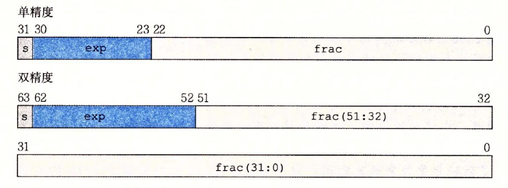
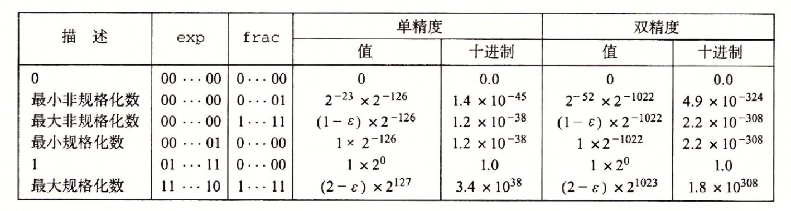
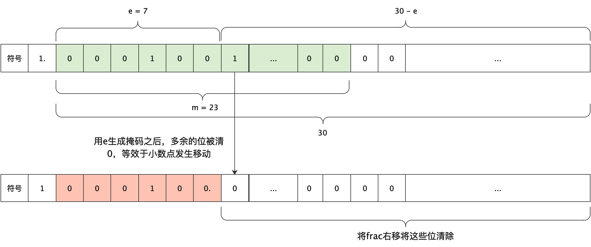

## 阅读笔记

### 字长

字长（word size）指的是指针数据的大小，也就是内存一次周期能读取到的数据长度。通常我们说的32bits/64bits就指的是字长。但是在微软API里面，定义WORD为16bits（为了对应Intel 8086最开始的时候16bits的字长），还有DWORD（32bits）和QWORD（64bits）。

### 布尔运算及定律

- 吸收律：$A+(A * B) = A$，$A * (A + B) = A$

- 分配律：$A(B+C) = AB + AC$，$A+(B*C) = (A+B)(A+C)$

- 德摩根定律：$\overline{AB} = \bar{A}+\bar{B}$​​​，$\overline{A+B} = \bar{A}\bar{B}$

### 异或

异或可以由与或非组合得出，即

`a ^ b `

 `= ~a · b + a · ~b `

`= a * ~a + b * ~b + ~a * b + a * ~b = (a + b) * (~a + ~b) `

 `= (a + b) * (~(a * b)) `，

将后一种形式里的 "+" 替换成 "~*" 组合即可使用最少的与非运算符实现异或

异或可以用于两数之间不需要中间变量的交换，其原理是利用了异或逆元的思想，即 a^a = 0

```c
// 设origa代表a的初始值，origb代表b的初始值
b = a ^ b; // 此时b = origa ^ origb
a = a ^ b; // 此时a = origa ^ origa ^ origb = 0 ^ origb = origb
b = a ^ b; // 此时b = origb ^ origa ^ origb，由于
```

## 常见位运算

- 对于有符号数来说，~x = -(x + 1)

- 自增1

  允许负号：-~num，不允许：num + 1

- 自减1

  允许负号：~-num，不允许：~(~num + 1)

- 判断x == y

  ```c
  !(x ^ y)
  ```

- 判断一个数是否小于0

  ```c
  !(x >> 31)
  ```

- 找到最高为1的位对应的阶数

  ```c
  // 32bits
  n |= (n >> 1);
  n |= (n >> 2);
  n |= (n >> 4);
  n |= (n >> 8);
  n |= (n >> 16);
  return n - (n >> 1);
  ```

  本质上是利用二分法将MSB为1的位向右传播，最终n会变为000111111...1的形式，然后计算出1对应的阶数

- 找到最低位为1对应的阶数

  ```c
  n & (n - 1)
  ```
  
- 二分法查找最高为1的位的索引

  ```c
  // 输出索引
  uint highest_one_idx(uint x) {
    if (x & 0xffff0000U) { x >>= 16; r += 16; }
    if (x & 0x0000ff00U) { x >>= 8;  r += 8; }
    if (x & 0x000000f0U) { x >>= 4;  r += 4; }
  	if (x & 0x0000000cU) { x >>= 2;  r += 2; }
    if (x & 0x02)        {					 r += 1; }
    return r;
  }
  
  // 不能使用if
  uint highest_one_idx(uint x) {
    int tmp = 0, idx = 0;
    // 等价于if (x > 0xffffu)
    tmp = (~((x >> 16) + ~0) >> 27) & 0x10;
    idx += tmp, abs >>= tmp;
    // if (x > 0xffu)
    tmp = (~((x >> 8) + ~0) >> 28) & 0x8;
    idx += tmp, abs >>= tmp;
    // if (x > 0xfu)
    tmp = (~((x >> 4) + ~0) >> 29) & 0x4;
    idx += tmp, abs >>= tmp;
    // if (x > 0x3u)
    tmp = (~((x >> 2) + ~0) >> 30) & 0x2;
    idx += tmp, abs >>= tmp;
    
    // if (x == 1)
    idx += (x & 0x02) >> 1;
    
    return r;
  }
  
  ```

- 二分法找到$log_2^n$

  ```c
  unsigned int ulog2 (unsigned int u)
  {
      unsigned int s, t;
  
      t = (u > 0xffff) << 4; u >>= t;
      s = (u > 0xff  ) << 3; u >>= s, t |= s;
      s = (u > 0xf   ) << 2; u >>= s, t |= s;
      s = (u > 0x3   ) << 1; u >>= s, t |= s;
  
      return (t | (u >> 1));
  }
  
  // 替换掉>号，和highest_one_idx相同
  unsigned int ulog2 (unsigned int u)
  {
      unsigned int r = 0, t;
  
      t = ((~((u >> 16) + ~0U)) >> 27) & 0x10;
      r |= t, u >>= t;
      t = ((~((u >>  8) + ~0U)) >> 28) &  0x8;
      r |= t, u >>= t;
      t = ((~((u >>  4) + ~0U)) >> 29) &  0x4;
      r |= t, u >>= t;
      t = ((~((u >>  2) + ~0U)) >> 30) &  0x2;
      r |= t, u >>= t;
  
      return (r | (u >> 1));
  }
  ```

### 位运算推荐资料

1. 《Hacker's Delight》这本书里面介绍了很多高效的算法

2. 《Matters Computational》有一章专门介绍各种bitwise算法

3. https://graphics.stanford.edu/~seander/bithacks.html

### 浮点数

十进制小数转二进制小数：整数部分和二进制整数转换方法相同，小数部分采用“乘二取整”，也就是小数部分每次乘2，然后取个位数作为二进制小数对应位的数字，再拿结果中剩下的小数部分继续乘2，直到小数部分为0或者满足精度为止。这种表示方法被称作定点表示法。

IEEE的浮点数表示，浮点数格式为$(-1)^s \times M \times 2^E$​​​，其中s表示符号位，M由$f_{n-1}f_{n-2}...f_0$​​组成，为**二进制小数**，被称为尾数，E被称为阶数，由exp表示。



单精度中，s=1，k=8，n=23，双精度中，s=1，k=11，n=52。根据阶数的不同分为不同的浮点数类型：

1. 规格化：0 < exp < $2^k-1$​​，此时实际的阶数$E=exp - bias$​​，$bias = 2^{k-1} - 1$​​，单精度中为127，双精度中为1023；M表示$1.f_{n-1}f_{n-2}...f_0$​​，即隐含了个位数的1。
2. 非规格化：exp == 0，此时阶数$E = 1-bias$​，M表示$0.f_{n-1}f_{n-2}...f_0$​​，此种格式用于表示0<num<1的浮点数。
3. exp全为1，此时如果frac为0，表示+∞或者-∞，如果不为1，则表示NaN，即数据出错（not a number），可以用来表示非法计算结果或者未初始化结果。

非规格化数定义为1-Bias的原因是为了补偿规格化数中的M隐含的1，使得非规格化数和规格化数之间能够平稳过渡。

#### 十进制整数转浮点数

先将整数转化为二进制小数，即$x*2^y, 1\leq x \lt 2$，然后舍弃x的个位数（也就是1），对小数部分补0到23位（单精度下），作为浮点数的M，计算阶数$E = y + bias$​，最后补上小数位。

#### 浮点数的极值



## DataLab

[此处](http://www.cs.cmu.edu/afs/cs/academic/class/15213-f02/www/daemons/dlcontest.html)有datalab 2002年的排行榜，其中包含当前最新实验的部分问题，给出了最少的操作数，仅供参考。

大部分问题的思路都是对数字划分不同的情况分别进行处理

### isTmax

利用0x7fffffff+1 == 0x80000000再相互异或为0的性质进行判断，但是-1(0xffffffff)也满足这个性质，因为!(-1+1) = 1，而!(0x7fffffff+1)=0，因此可以利用这个性质。

```c
!(~(x + !(x + 1)) ^ (x + 1))
```

### isLessOrEqual

less分为两种情况，一种是符号位相同，只需比较x-y < 0，另一种是符号位不同，比较符号位即可。

equal使用!(x^y)判断。为了减少操作数，取符号数的移位操作可以放到最后再执行

```c
  int res = x ^ y;
  int flag1 = (~res) & (x + ~y + 1); // 符号相同，判断x-y < 0
  int flag2 = x & (~y); // 符号不同，判断符号
  int equal = !res;
  return equal | ((flag1 | flag2) >> 31 & 1);
```

### logicalNeg

初始版本

```c
  int sign = (x >> 31) & 1; // 判断是否是负数
  int nonzero = ((x ^ (~x + 1)) >> 31) & 1; // 判断是否为0
  return (~(sign | nonzero)) & 1; // 判断符号位
```

合并右移符号的最终版本

```c
  int res = x ^ (~x + 1); 
  return (~(res | x) >> 31) & 1;
```

### howManyBits

思路：首先求得x的绝对值abs，然后计算abs的为1的最高位的索引，由于求出的索引是从0开始的，需要先加上1，然后分情况讨论：

1. 如果x是正数，则需要多一个符号位

2. 如果x是0，则不需要符号位

3. 如果x是负数，当求出来的索引对应的负数大于x本身时，需要向前再多一位，也即

   -(1 << idx) > x，等价于(x + (1 << idx)) < 0

4. 如果x是Tmin，由于int的范围是Tmin <= x <= -Tmin + 1，因此绝对值会超出范围，所以需要单独讨论，如果是Tmin就返回32

```c
int howManyBits(int x) {
    int mask = (x >> 31);
    int positive = ((!!x) & !(mask & 1));
    int abs = (x + mask) ^ mask; // 绝对值
    int idx = 0, tmp = 0;
    int isMin = !(x ^ (1 << 31));

    // 计算最高位的索引
    tmp = (~((abs >> 16) + ~0) >> 27) & 0x10;
    idx += tmp, abs >>= tmp;
    tmp = (~((abs >> 8) + ~0) >> 28) & 0x8;
    idx += tmp, abs >>= tmp;
    tmp = (~((abs >> 4) + ~0) >> 29) & 0x4;
    idx += tmp, abs >>= tmp;
    tmp = (~((abs >> 2) + ~0) >> 30) & 0x2;
    idx += tmp, abs >>= tmp;
    idx += (abs & 0x02) >> 1;

    isMin = ~isMin + 1;

    return (isMin & 32) + (~isMin & (idx + (positive | ((x + (1 << idx)) >> 31 & 1)) + 1)); 
}
```

### floatScale2

分为规格化和非规格化两种情况进行讨论。

非规格化需要判断小数部分*2之后是否超过1（进位），如果进位（超过1），则需要转换成规格化（e = 1)。

规格化只需要阶数加1即可，并判断是否到正无穷

```c
unsigned floatScale2(unsigned uf) {
  unsigned e = (uf >> 23) & 0xffu;
  unsigned mmask = (1 << 23) - 1;
  unsigned m = uf & mmask;
  unsigned newe = 0, newm = m;
  unsigned scale2m = 2 * m, beyond = (scale2m >> 23) & 1;
  unsigned inm = scale2m & mmask;
  if (e == 0xffu) return uf;
  // 非规格化，需要判断乘于2是否满足规格化
  if (e == 0) {
    newm = inm;
    if (beyond) newe = 1; 
  } else {
    // 规格化，直接递增e
    newe = e + 1;
    if (newe == 0xffu) {
      newm = 0;
    };
  }
  return (uf & (1 << 31)) | (newe << 23) | newm;
}
```

### floatFloat2Int

同样是分类讨论，如果是非规格化的，由于最小都是$2^{-127}$，直接返回0。

如果是规格化，如果e < 127，则表明e-bias < 0，是一个小于1的数字，返回0。

计算出阶数后，如果阶数>30，则表明超出int的范围（对于-Tmin = -2^31，返回的正好是1<<31）

然后对frac进行处理，首先将frac扩充成31位小数（因为转换为int包含一个符号位），并加上隐含的1。然后根据阶数生成mask，对超出e之后的取0，然后将frac转换成整数，下图展现了frac的变化情况。



```c
int floatFloat2Int(unsigned uf) {
  unsigned e = (uf >> 23) & 0xffu;
  unsigned frac = (uf & ((1 << 23) - 1));
  unsigned sign = (uf >> 31) & 1;
  unsigned num = 0, mask;
  // 判断inf/nan
  if (e == 0xffu) return (1 << 31);
  // 非规格化
  if (e == 0) return 0;
  // 规格化，加上隐含的1，扩充到31位方便后续处理
  frac = (frac | (1 << 23)) << 7;
  if (e < 127) return 0; // 小数返回0
  e -= 127;
  // e可能非常大，需要判断是否超出范围，由于预留符号位，所以e不可能超过30
  if (e > 30) return 1 << 31;
  mask = (-1 << (30 - e));
  num = ((frac & mask) >> (30 - e));
  if (sign) num = ~num + 1;
  return num;
}
```

### floatPower2

由于非规格化最小只能表示$2^{-126-23}$​，规格化最大能到$(2-\epsilon) * 2^{127}$​，开始需要判断x的范围是否超过最大值和最小值。

当$-149 \le x \lt -126$​​​​时，frac需要补上减去e之后的阶数。

```c
unsigned floatPower2(int x) {
  unsigned e = 0, frac = 0;
  // 非规格数最小到2^-149
  if (x < -149) return 0;
  // 规格数最大到2^127
  if (x > 127) return 0x7F800000u;
    
  if (x >= -126) {
    e = x + 127;
  } else if (x < -126) {
    frac = (1 << (149 + x));
  }
  return (e << 23) | frac;
}
```
