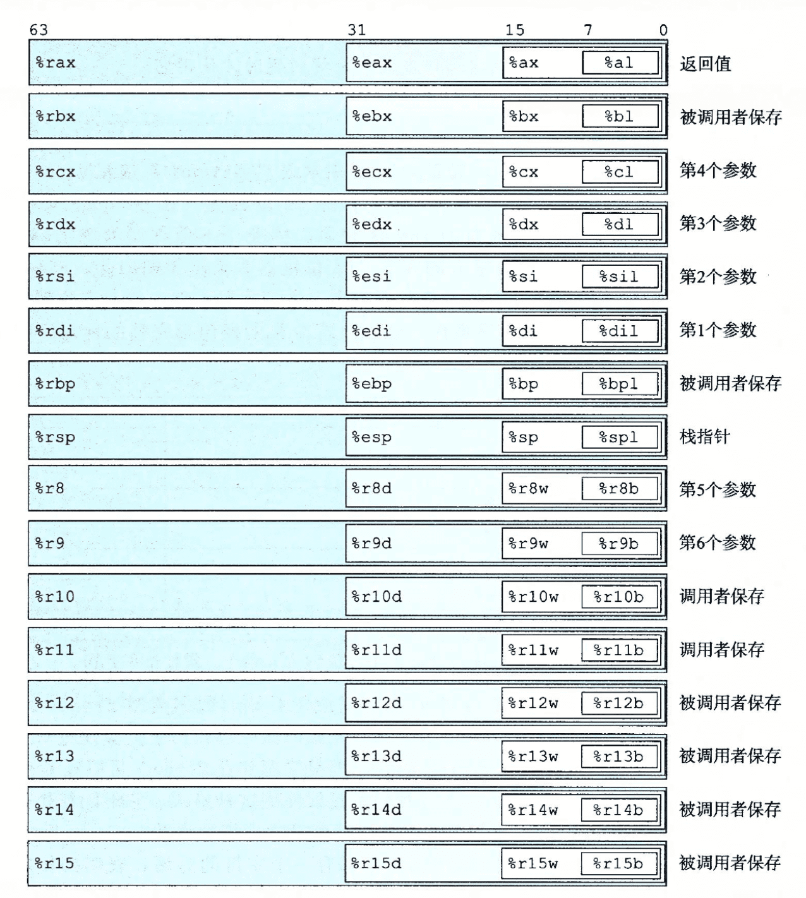
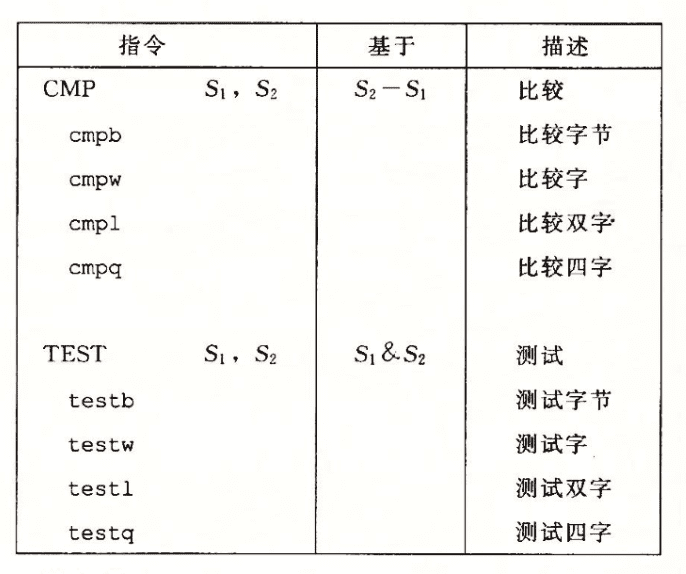
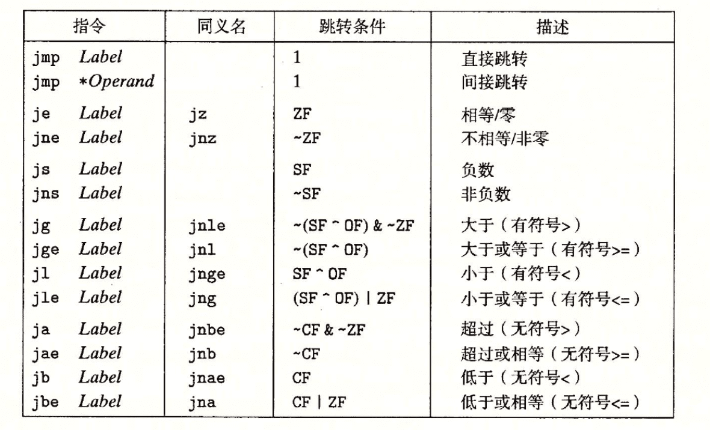
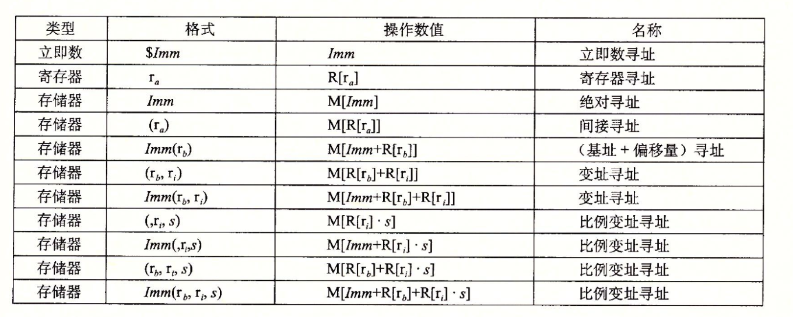
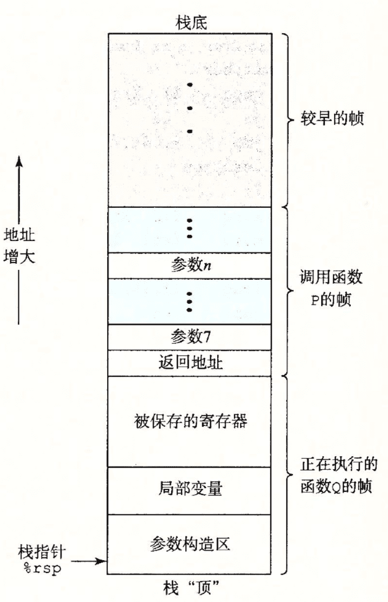
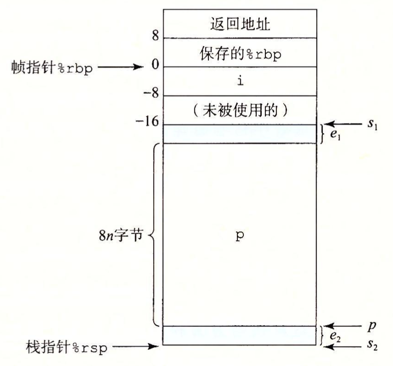
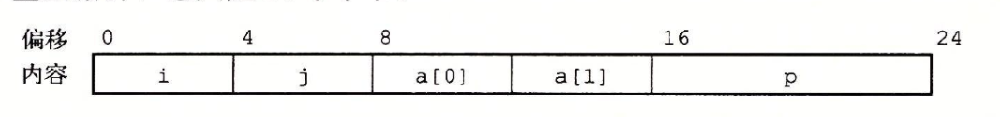

[这里](https://github.com/zianglei/csapp-labs)可以找到实验代码

## 程序代码的汇编表示

### 寄存器

#### 整数寄存器



#### 条件码寄存器

- CF：进位标志，表示最高位产生了进位
- ZF：零标志，最近的操作结果为0
- SF：符号标志，最近的操作结果为负数
- OF：溢出标志，导致补码溢出，正溢出或负溢出

#### 栈寄存器

栈指针 %rsp 保存栈顶元素的数据，将数据压入栈是将 %rsp-8，然后存储数据；弹出栈是将 M[%rsp] 取出，然后%rsp+8。

编译器会为每个函数计算需要的栈空间，然后在函数的开头对%rsp进行减操作，分配栈空间，在函数结束返回的时候对%rsp加操作，恢复栈空间

#### pc寄存器

%rip 代表指令计数器，表示当前执行指令的地址

### ATT与Intel格式的区别

ATT是AT&T提出的汇编代码格式，GCC、OBJDUMP等工具的默认格式。而Intel格式是Intel提出的，通常用于Microsoft的工具和Intel自身的文档。

两者区别是

- Intel省略了指示大小的后缀，例如l，q等
- Intel省略了寄存器的‘%’前缀
- Intel使用QWORD PTR [rbx]来表示内存位置，而不是(rbx)这种形式
- 在带有多个操作数的情况下，操作数的顺序相反，即目的寄存器在前，源寄存器在后。

在gcc生成汇编代码的时候，可以使用`-masm=intel`选项指定生成Intel格式的汇编代码，默认是ATT格式。

### 常见指令

####  条件指令



常见TEST %rax, %rax，判断%rax是否等于0，如果等于0，会设置ZF标志位，如果后跟je指令，就满足条件，跳转

#### 跳转指令



在跳转的时候，有些指令会采用PC相对寻址，即指令编码中只记录offset，实际跳转的目的指令地址是next PC + offset，即下一条指令地址+offset，而不是当前PC的值

#### 算术运算

add S,D -> D = D + S

sub S,D -> D = D - S

#### 数据传送

mov S,D -> D = S

注意movl传送四字节，会将高位四字节设置为0，这样是因为 x86-64 的惯例是任何为寄存器生成 32 位值的指令都会把该寄存器的高位部分置成0。

#### 读取有效地址

lea并不会从指定地址读取数据到目的位置，而是将地址存储到目的位置

#### 操作数格式



### 栈帧



x86-64提供六个寄存器用于函数参数传递（%rdi, %rsi, %rdx, %rcx, %r8, %r9），每一个调用的函数都会事先在栈上开辟空间，填入需要存储的变量。%rsp 指向栈顶位置，可以通过 pushq 和 popq 指令对 %rsp 进行操作。当函数 P 调用函数 Q 时，函数 P 会首先将函数 Q 执行完毕后的返回地址压入栈，通常返回地址是调用函数 Q 语句的下一个执行语句地址。

进入函数 Q 后，通常第一步就是事先分配栈空间，保存寄存器的值，分配局部变量，或者为函数 Q  调用的其他函数设置传递的参数。如果函数需要的参数非常多，六个寄存器不够放，那么就需要在调用者的栈中另外开辟空间，如图中的传入函数 Q 的参数7至参数n。

通常分配的栈空间是确定的，也就是在汇编代码里使用的是立即数，而对于需要使用变长栈帧的场景，例如需要动态分配栈空间，gcc会事先保存寄存器 %rbp 的值，然后将%rbp指向当前新的栈底。




当进入新的函数时（call指令），返回地址被压入栈，在栈中的地址是 %rsp

### 结构体

对于



这样的结构体，假设%rdi存储结构体的地址，那么

```assembly
movl (%rdi) %eax # %eax = st->i
movl %eax 4(%rdi) # st->j = %eax
```

### 条件分支

条件分支转换成汇编代码，通常将有条件和无条件的跳转结合起来使用。

对于

```c
if (test-expr)
  then-statement
else
  else-statement
```

通常会转换成

```assembly
    t = test-expr;
    if (!t)
	  goto false;
    then-statement
    goto done;
false:
    else-statement
done:
```

条件分支根据条件是否满足决定走哪条路径，但是现代处理器使用流水线执行，如果条件预测失败，产生的错误惩罚成本会非常高。因此一种替代的策略是使用<strong>数据</strong>的条件传送，即计算一个条件操作的两个结果，然后根据条件满足选取其中一个，不过这种策略仅在受限条件下才可行。

例如

 ```c
 long cmovdiff(long x, long y) {
   long result;
   if (x < y)
     result = y - x;
   else 
     result = x - y;
   return result;
 }
 ```

优化后的汇编指令为

```assembly
absdiff:
	movq %rsi, %rax
	subq %rdi, %rax # 计算 y-x
	movq %rdi, %rdx
	subq %rsi, %rdx # 计算 x-y
  cmpq %rsi, %rdi
  cmovge %rdx, %rax # 使用条件移动指令，
  ret
```

条件传送指令不需要使用预测，只是读取源数据，检查条件码，然后更新目的寄存器或者保持不变。

#### 如何确定分支预测错误的处罚

假设分支预测错误的处罚概率是p，如果没有预测错误，执行代码时间是$T_{ok}$，预测错误的处罚是$T_{MP}$，那么平均时间是$T = (1-p)T_{ok}+p(T_{ok}+T_{MP})$

#### 条件传送的限制

条件传送的限制是有些分支可能会产生错误条件或者副作用，因此不适用于条件数据传送

### 循环

#### do...while

do...while翻译成汇编语言的例子如下

```c
long fact_do(long n) {
  long result = 1;
loop:
  result *= n;
  n = n - 1;
  if (n > 1)
    goto loop;
  return result;
}
```

```assembly
fact_do:
	movl $1, %eax
.L2:
	imulq %rdi, %rax
	subq $1, %rdi
	cmpq $1, %rdi
	jg   .L2
	rep; ret
```

#### while

while循环有两种翻译方式，一种是jump to middle（跳转到中间），使用无条件跳转到判断条件，再跳转到

```assembly
    goto test;
loop:
		body-statement
test:
		t = test-expr;
		if (t)
			goto loop;
```

第二种方法，称之为guarded-do，使用条件分支，如果初始条件不成立，就跳过循环，把代码变成do-while循环。当使用-O1级别优化的时候，会采用这种方式

```assembly
t = test-exptr;
if (!t) 
	goto done;
loop:
	body-statement
	if (t) goto loop
done:
	some-statements
```

#### for

for循环通常的翻译方式是转换成while循环再翻译，例如

```assembly
for(init-expr; test-expr; update-expr)
	body-statement
```

```c
init-expr;
while(test-expr) {
	body-statement
  update-expr
}
```

然后选择jump to middle或者guarded-do方法

## bomb lab

分为5个阶段，需要使用objdump对bomb这个二进制文件进行反汇编

```bash
objdump -d ./bomb > bomb.s
```

使用gdb打断点，layout asm可以切换到汇编代码界面，si单步执行，ni调到下一条汇编指令

### 常用gdb调试命令

- x/\[length]\[format] addr：打印memory[addr]的值

- info registers reg：打印寄存器的值，例如info registers rbp
- set $reg=value：设置寄存器的值
- ctrl-p/n：在文本模式下读取上一个/下一个执行过的命令
- ctrl-b/f：在文本模式下光标左/右移动

#### gdb断点自动执行命令

因为起初我们无法得知字符串的具体内容，为了加快效率，我们在得到当前字符后需要将之前输入的字符进行修改，让程序继续执行，提高调试效率。gdb提供了在断点后添加命令的功能，能够在每次断点触发后自动执行。具体可以参考[这里](https://sourceware.org/gdb/current/onlinedocs/gdb/Break-Commands.html#Break-Commands)。

注意事项：bomb lab支持使用文件输入代替终端输入，文件中的每一行输入后面都要带有一个空格，并且是作为参数传递，而不是文件重定向输入，即

```bash
./bomb answer.txt
```

而不是

```bash
./bomb < answer.txt
```

在gdb中传入命令行参数可以使用`run param1 param2...`

### phase 1

通过strings_not_equal来判断输入的字符串和当前谜题字符串是否相同

第一个字符串是输入的字符串，第二个字符串是谜题字符串

```assembly
  401338:	41 54                	push   %r12
  40133a:	55                   	push   %rbp
  40133b:	53                   	push   %rbx
  40133c:	48 89 fb             	mov    %rdi,%rbx # 将第一个参数保存到rbx
  40133f:	48 89 f5             	mov    %rsi,%rbp # 将第二个参数保存到rbp
  401342:	e8 d4 ff ff ff       	callq  40131b <string_length>
  401347:	41 89 c4             	mov    %eax,%r12d # r12d 保存第一个字符串的长度 (用户输入的)
  40134a:	48 89 ef             	mov    %rbp,%rdi
  40134d:	e8 c9 ff ff ff       	callq  40131b <string_length>
  401352:	ba 01 00 00 00       	mov    $0x1,%edx
  401357:	41 39 c4             	cmp    %eax,%r12d # 比较两个字符串的长度
  40135a:	75 3f                	jne    40139b <strings_not_equal+0x63> # 如果不相同就结束
  40135c:	0f b6 03             	movzbl (%rbx),%eax  # 拷贝第一个字符串的当前字符到eax
  40135f:	84 c0                	test   %al,%al # if (al & 0xff == 0) je 401388
  401361:	74 25                	je     401388 <strings_not_equal+0x50>
  401363:	3a 45 00             	cmp    0x0(%rbp),%al # 比较用户输入字符串的当前字符
  401366:	74 0a                	je     401372 <strings_not_equal+0x3a> # 相同就跳到401372
  401368:	eb 25                	jmp    40138f <strings_not_equal+0x57>
  40136a:	3a 45 00             	cmp    0x0(%rbp),%al # 比较字符串是否相同
  40136d:	0f 1f 00             	nopl   (%rax)
  401370:	75 24                	jne    401396 <strings_not_equal+0x5e> # 不相同跳到401396，退出
  401372:	48 83 c3 01          	add    $0x1,%rbx # rbx和rbp都加1，也就是循环继续
  401376:	48 83 c5 01          	add    $0x1,%rbp
  40137a:	0f b6 03             	movzbl (%rbx),%eax # 拷贝第一个字符串当前字符到eax
  40137d:	84 c0                	test   %al,%al # 如果字符串结束，就退出
  40137f:	75 e9                	jne    40136a <strings_not_equal+0x32> # 循环继续
  401381:	ba 00 00 00 00       	mov    $0x0,%edx # 返回0
  401386:	eb 13                	jmp    40139b <strings_not_equal+0x63>
  401388:	ba 00 00 00 00       	mov    $0x0,%edx
  40138d:	eb 0c                	jmp    40139b <strings_not_equal+0x63>
  40138f:	ba 01 00 00 00       	mov    $0x1,%edx
  401394:	eb 05                	jmp    40139b <strings_not_equal+0x63>
  401396:	ba 01 00 00 00       	mov    $0x1,%edx # 返回1，代表不相同
  40139b:	89 d0                	mov    %edx,%eax
  40139d:	5b                   	pop    %rbx
  40139e:	5d                   	pop    %rbp
  40139f:	41 5c                	pop    %r12
  4013a1:	c3                   	retq   
```

通过strings_not_equal的第二个参数拿到谜题字符串的内存首地址，使用x/[length]c，可以拿到谜题字符串的具体内容。

### phase 2

```assembly
  400efc:	55                   	push   %rbp
  400efd:	53                   	push   %rbx
  400efe:	48 83 ec 28          	sub    $0x28,%rsp
  400f02:	48 89 e6             	mov    %rsp,%rsi
  400f05:	e8 52 05 00 00       	callq  40145c <read_six_numbers>
  400f0a:	83 3c 24 01          	cmpl   $0x1,(%rsp) ; (%rsp)为第一个数，要求为1
  400f0e:	74 20                	je     400f30 <phase_2+0x34>
  400f10:	e8 25 05 00 00       	callq  40143a <explode_bomb>
  400f15:	eb 19                	jmp    400f30 <phase_2+0x34>
  400f17:	8b 43 fc             	mov    -0x4(%rbx),%eax
  400f1a:	01 c0                	add    %eax,%eax
  400f1c:	39 03                	cmp    %eax,(%rbx) ; 后一个数是前一个数的两倍
  400f1e:	74 05                	je     400f25 <phase_2+0x29>
  400f20:	e8 15 05 00 00       	callq  40143a <explode_bomb>
  400f25:	48 83 c3 04          	add    $0x4,%rbx ; rbx跳到下一个数
  400f29:	48 39 eb             	cmp    %rbp,%rbx ; 判断循环是否结束
  400f2c:	75 e9                	jne    400f17 <phase_2+0x1b>
  400f2e:	eb 0c                	jmp    400f3c <phase_2+0x40>
  400f30:	48 8d 5c 24 04       	lea    0x4(%rsp),%rbx ; 从第二个数字开始循环
  400f35:	48 8d 6c 24 18       	lea    0x18(%rsp),%rbp ; 循环结束位置
  400f3a:	eb db                	jmp    400f17 <phase_2+0x1b> 
  400f3c:	48 83 c4 28          	add    $0x28,%rsp
  400f40:	5b                   	pop    %rbx
  400f41:	5d                   	pop    %rbp
  400f42:	c3                   	retq   
  
 000000000040145c <read_six_numbers>:
  40145c:	48 83 ec 18          	sub    $0x18,%rsp
  401460:	48 89 f2             	mov    %rsi,%rdx ; 第一个数字的位置（old rsp)
  401463:	48 8d 4e 04          	lea    0x4(%rsi),%rcx ; 第二个数字的位置
  401467:	48 8d 46 14          	lea    0x14(%rsi),%rax ; 第六个数字的位置
  40146b:	48 89 44 24 08       	mov    %rax,0x8(%rsp)  ; 第六个数字的位置放到%rsp+8位置
  401470:	48 8d 46 10          	lea    0x10(%rsi),%rax ; 第五个数字的位置
  401474:	48 89 04 24          	mov    %rax,(%rsp)    ; 第五个数字的地址放到%rsp位置
  401478:	4c 8d 4e 0c          	lea    0xc(%rsi),%r9  ; 第四个数字
  40147c:	4c 8d 46 08          	lea    0x8(%rsi),%r8  ; 第三个数字
  401480:	be c3 25 40 00       	mov    $0x4025c3,%esi ; 读取六个数字的格式字符串
  401485:	b8 00 00 00 00       	mov    $0x0,%eax
  40148a:	e8 61 f7 ff ff       	callq  400bf0 <__isoc99_sscanf@plt>
  40148f:	83 f8 05             	cmp    $0x5,%eax ; 如果没有读取够六个数字，引爆炸弹
  401492:	7f 05                	jg     401499 <read_six_numbers+0x3d>
  401494:	e8 a1 ff ff ff       	callq  40143a <explode_bomb>
  401499:	48 83 c4 18          	add    $0x18,%rsp
  40149d:	c3                   	retq   
```

根据代码分析，要求输入的六个数，后一个数是前一个数的两倍，且第一个数为1

### phase 3

```assembly
0000000000400f43 <phase_3>:
  400f43:	48 83 ec 18          	sub    $0x18,%rsp
  400f47:	48 8d 4c 24 0c       	lea    0xc(%rsp),%rcx
  400f4c:	48 8d 54 24 08       	lea    0x8(%rsp),%rdx
  400f51:	be cf 25 40 00       	mov    $0x4025cf,%esi
  400f56:	b8 00 00 00 00       	mov    $0x0,%eax
  400f5b:	e8 90 fc ff ff       	callq  400bf0 <__isoc99_sscanf@plt>
  400f60:	83 f8 01             	cmp    $0x1,%eax
  400f63:	7f 05                	jg     400f6a <phase_3+0x27>
  400f65:	e8 d0 04 00 00       	callq  40143a <explode_bomb>
  400f6a:	83 7c 24 08 07       	cmpl   $0x7,0x8(%rsp)					
  400f6f:	77 3c                	ja     400fad <phase_3+0x6a>  ; 读取的第一个数不能大于7
  400f71:	8b 44 24 08          	mov    0x8(%rsp),%eax
  400f75:	ff 24 c5 70 24 40 00 	jmpq   *0x402470(,%rax,8)			; switch语句
  400f7c:	b8 cf 00 00 00       	mov    $0xcf,%eax
  400f81:	eb 3b                	jmp    400fbe <phase_3+0x7b>
  400f83:	b8 c3 02 00 00       	mov    $0x2c3,%eax
  400f88:	eb 34                	jmp    400fbe <phase_3+0x7b>
  400f8a:	b8 00 01 00 00       	mov    $0x100,%eax
  400f8f:	eb 2d                	jmp    400fbe <phase_3+0x7b>
  400f91:	b8 85 01 00 00       	mov    $0x185,%eax
  400f96:	eb 26                	jmp    400fbe <phase_3+0x7b>
  400f98:	b8 ce 00 00 00       	mov    $0xce,%eax
  400f9d:	eb 1f                	jmp    400fbe <phase_3+0x7b>
  400f9f:	b8 aa 02 00 00       	mov    $0x2aa,%eax
  400fa4:	eb 18                	jmp    400fbe <phase_3+0x7b>
  400fa6:	b8 47 01 00 00       	mov    $0x147,%eax
  400fab:	eb 11                	jmp    400fbe <phase_3+0x7b>
  400fad:	e8 88 04 00 00       	callq  40143a <explode_bomb>
  400fb2:	b8 00 00 00 00       	mov    $0x0,%eax
  400fb7:	eb 05                	jmp    400fbe <phase_3+0x7b>
  400fb9:	b8 37 01 00 00       	mov    $0x137,%eax
  400fbe:	3b 44 24 0c          	cmp    0xc(%rsp),%eax
  400fc2:	74 05                	je     400fc9 <phase_3+0x86>
  400fc4:	e8 71 04 00 00       	callq  40143a <explode_bomb>
  400fc9:	48 83 c4 18          	add    $0x18,%rsp
  400fcd:	c3                   	retq   
```

根据代码分析phase3是一个switch结构，查看0x4025cf地址，发现格式化字符串是"%d %d"，即读取两个数，第一个数不能大于7，然后根据第一个数选择不同的分支

### phase 4

```assembly
000000000040100c <phase_4>:
  40100c:	48 83 ec 18          	sub    $0x18,%rsp
  401010:	48 8d 4c 24 0c       	lea    0xc(%rsp),%rcx
  401015:	48 8d 54 24 08       	lea    0x8(%rsp),%rdx
  40101a:	be cf 25 40 00       	mov    $0x4025cf,%esi ; "%d %d", 读取两个整数
  40101f:	b8 00 00 00 00       	mov    $0x0,%eax
  401024:	e8 c7 fb ff ff       	callq  400bf0 <__isoc99_sscanf@plt>
  401029:	83 f8 02             	cmp    $0x2,%eax 
  40102c:	75 07                	jne    401035 <phase_4+0x29>
  40102e:	83 7c 24 08 0e       	cmpl   $0xe,0x8(%rsp) ; 第一个数要 < 14
  401033:	76 05                	jbe    40103a <phase_4+0x2e> 
  401035:	e8 00 04 00 00       	callq  40143a <explode_bomb>
  40103a:	ba 0e 00 00 00       	mov    $0xe,%edx
  40103f:	be 00 00 00 00       	mov    $0x0,%esi
  401044:	8b 7c 24 08          	mov    0x8(%rsp),%edi
  401048:	e8 81 ff ff ff       	callq  400fce <func4> ; func4(num1, 0, 14)
  40104d:	85 c0                	test   %eax,%eax			; 要求返回值必须为0
  40104f:	75 07                	jne    401058 <phase_4+0x4c>
  401051:	83 7c 24 0c 00       	cmpl   $0x0,0xc(%rsp) ; 第二个数 == 0
  401056:	74 05                	je     40105d <phase_4+0x51>
  401058:	e8 dd 03 00 00       	callq  40143a <explode_bomb>
  40105d:	48 83 c4 18          	add    $0x18,%rsp
  401061:	c3                   	retq   
```

```assembly
0000000000400fce <func4>:
  400fce:	48 83 ec 08          	sub    $0x8,%rsp
  400fd2:	89 d0                	mov    %edx,%eax
  400fd4:	29 f0                	sub    %esi,%eax
  400fd6:	89 c1                	mov    %eax,%ecx
  400fd8:	c1 e9 1f             	shr    $0x1f,%ecx
  400fdb:	01 c8                	add    %ecx,%eax
  400fdd:	d1 f8                	sar    %eax
  400fdf:	8d 0c 30             	lea    (%rax,%rsi,1),%ecx
  400fe2:	39 f9                	cmp    %edi,%ecx
  400fe4:	7e 0c                	jle    400ff2 <func4+0x24>
  400fe6:	8d 51 ff             	lea    -0x1(%rcx),%edx
  400fe9:	e8 e0 ff ff ff       	callq  400fce <func4>
  400fee:	01 c0                	add    %eax,%eax
  400ff0:	eb 15                	jmp    401007 <func4+0x39>
  400ff2:	b8 00 00 00 00       	mov    $0x0,%eax
  400ff7:	39 f9                	cmp    %edi,%ecx
  400ff9:	7d 0c                	jge    401007 <func4+0x39>
  400ffb:	8d 71 01             	lea    0x1(%rcx),%esi
  400ffe:	e8 cb ff ff ff       	callq  400fce <func4>
  401003:	8d 44 00 01          	lea    0x1(%rax,%rax,1),%eax
  401007:	48 83 c4 08          	add    $0x8,%rsp
  40100b:	c3                   	retq
```

注意 sar %eax，只有一个参数，表示sar %eax, 1

将func4转换成c代码如下

```c
int func4(int64_t a1, int64_t a2, int64_t a3) {
    // v1: $eax, v2: $ecx;
    int64_t v1, v2;
    v1 = a3 - a2;
    v2 = unsigned(v1) >> 31;
    v1 = (v1 + v2) >> 1;
    v2 = (v1 & 0xffff) + a2;
    if (v2 <= a1) {
        // 400ff2
        if (v2 >= a1) return 0;
        int ret = func4(a1, v2 & 0xffff + 1, a3);
        return 2 * ret + 1;
    } else {
        return 2 * func4(a1, a2, v2 & 0xffff - 1);
    }
}
```

phase 4要求func4返回0，而a2初始为0，a3初始为14，计算得第一次调用func4，v2==7，因此可以设置a1为7，直接返回0即可

### phase 5

```assembly
0000000000401062 <phase_5>:
  401062:	53                   	push   %rbx
  401063:	48 83 ec 20          	sub    $0x20,%rsp
  401067:	48 89 fb             	mov    %rdi,%rbx
  40106a:	64 48 8b 04 25 28 00 	mov    %fs:0x28,%rax
  401071:	00 00 
  401073:	48 89 44 24 18       	mov    %rax,0x18(%rsp)
  401078:	31 c0                	xor    %eax,%eax
  40107a:	e8 9c 02 00 00       	callq  40131b <string_length>
  40107f:	83 f8 06             	cmp    $0x6,%eax ; 输入的字符串长度为6
  401082:	74 4e                	je     4010d2 <phase_5+0x70>
  401084:	e8 b1 03 00 00       	callq  40143a <explode_bomb>
  401089:	eb 47                	jmp    4010d2 <phase_5+0x70>
  40108b:	0f b6 0c 03          	movzbl (%rbx,%rax,1),%ecx ; %rbx为输入的字符串
  40108f:	88 0c 24             	mov    %cl,(%rsp) 
  401092:	48 8b 14 24          	mov    (%rsp),%rdx ; %rdx存储输入字符串的字符
  401096:	83 e2 0f             	and    $0xf,%edx ; 与0xf与得到索引
  401099:	0f b6 92 b0 24 40 00 	movzbl 0x4024b0(%rdx),%edx # 按照索引取0x4024b0字符串里的字符
  4010a0:	88 54 04 10          	mov    %dl,0x10(%rsp,%rax,1) # 将转换好的字符串依次放到起始位置为rsp + 0x10的字符串
  4010a4:	48 83 c0 01          	add    $0x1,%rax
  4010a8:	48 83 f8 06          	cmp    $0x6,%rax
  4010ac:	75 dd                	jne    40108b <phase_5+0x29>
  4010ae:	c6 44 24 16 00       	movb   $0x0,0x16(%rsp)
  4010b3:	be 5e 24 40 00       	mov    $0x40245e,%esi # 与在0x40245e的字符串进行比较
  4010b8:	48 8d 7c 24 10       	lea    0x10(%rsp),%rdi
  4010bd:	e8 76 02 00 00       	callq  401338 <strings_not_equal>
  4010c2:	85 c0                	test   %eax,%eax
  4010c4:	74 13                	je     4010d9 <phase_5+0x77>
  4010c6:	e8 6f 03 00 00       	callq  40143a <explode_bomb>
  4010cb:	0f 1f 44 00 00       	nopl   0x0(%rax,%rax,1)
  4010d0:	eb 07                	jmp    4010d9 <phase_5+0x77>
  4010d2:	b8 00 00 00 00       	mov    $0x0,%eax
  4010d7:	eb b2                	jmp    40108b <phase_5+0x29>
  4010d9:	48 8b 44 24 18       	mov    0x18(%rsp),%rax
  4010de:	64 48 33 04 25 28 00 	xor    %fs:0x28,%rax
  4010e5:	00 00 
  4010e7:	74 05                	je     4010ee <phase_5+0x8c>
  4010e9:	e8 42 fa ff ff       	callq  400b30 <__stack_chk_fail@plt>
  4010ee:	48 83 c4 20          	add    $0x20,%rsp
  4010f2:	5b                   	pop    %rbx
  4010f3:	c3                   	retq
```

根据代码分析，我们要输入一个长度为6的字符串，然后输入字符串的每个字符和0xf进行与运算，得到低4字节作为索引，用这个索引去取0x4024b0处存放的字符串中的字符（该字符串是maduiersnfotvbyl），将新形成的字符与0x40245e处的字符串进行比较（字符串是flyers）

### phase 6

代码比较长，分析下来就是对链表进行操作，转换成的C代码如下

```c
struct node {
    int data;
    int index;
    struct node* next;
};

struct Node list[6] = {
    {332, 1, &list[1]},
    {168, 2, &list[2]},
    {924, 3, &list[3]},
    {691, 4, &list[4]},
    {477, 5, &list[5]},
    {433, 6, NULL}
};

struct Node* stack[21];

void phase_6() {
    int nums[6];
    for(int i = 0; i < 6; ++i) {
        if (nums[i] > 6) return -1; // bomb!
        for(int j = i + 1; j <= 5; j++) {
            if (nums[i] == nums[j]) return -1; // bomb!
        }
    }
    for(int i = 0; i < 6; ++i) {
        nums[i] = 7 - nums[i];
    }
    for(int i = 0; i < 6; ++i) {
        if (nums[i] <= 1) {
            stack[8 + 2 * i] = list;
        } else {
            // t: %rdx, cnt: %eax
            struct Node* t = list;
            int cnt = 1;
            do {
                t = t->next;
                cnt++;
            } while(cnt != nums[i]);
            // 401188
            stack[8 + 2 * i] = t;
        }
    }
    // 原始翻译
    // struct Node** rsi = &stack[20];
    // struct Node** rax = &stack[10];
    // struct Node*  rbx = stack[8];
    // struct Node*  rcx = rbx;
    // struct node*  rdx;
    // do {
    //     rdx = *rax;
    //     rcx->next = rdx;
    //     rax += 2;
    //     if (rsi == rax) {
    //         break;
    //     }
    //     rcx = rdx;
    // } while(1);

    struct Node* node = stack[8];
    struct Node** next = &stack[10];
    for(node = stack[8]; node != stack[20]; node = node->next) {
        node->next = *next;
        next += 2; // 在stack中向后移动两个
    }
    
    start->next = 0;

    start = stack[8];
    int t = 5, data;
    while(t != 0) {
        next = start->next;
        data = rax->data;
        // 检查新生成的链表是否是倒序排列
        if (start->data < data) {
            return -1;
        } else {
            start = start->next;
            t--;
        }
    }
}
```

要求输入6个数，每个数均<=6，且这6个数各不相同。7-数字得到索引，根据后面的代码，可以得出这些索引是用来指示新的倒序排序的链表中的数字，在原始链表中的位置（从1开始）。比如924在新的链表中排在第一位，原始链表中是在第3位，那么输入的第一个数应该就是4。

### secret_phase

在反汇编代码中，我们可以看到有个secret_phase的函数，表明有一个隐藏问题。根据调用关系，该函数是在phase_defused中被调用。代码中首先执行了sscanf，根据得到的参数个数，如果是3个且最后一个字符串和0x402622的字符串相同，就会调用secret_phase。

由于sscanf读取的字符串是固定位置（0x603870），在整个代码中并没有找到对应位置，所以就在此处下断点，查看每次解完一个谜题之后该处字符串的变化，在输入第4个谜题之后，发现此处字符串为我们输入的字符串，因此可以确定是在输入第三个谜题答案之后再跟一个字符串（0x402622的字符串）即可开启隐藏谜题。

```assembly
00000000004015c4 <phase_defused>:
  4015c4:	48 83 ec 78          	sub    $0x78,%rsp
  4015c8:	64 48 8b 04 25 28 00 	mov    %fs:0x28,%rax
  4015cf:	00 00 
  4015d1:	48 89 44 24 68       	mov    %rax,0x68(%rsp)
  4015d6:	31 c0                	xor    %eax,%eax
  4015d8:	83 3d 81 21 20 00 06 	cmpl   $0x6,0x202181(%rip)        # 603760 <num_input_strings>
  4015df:	75 5e                	jne    40163f <phase_defused+0x7b>
  4015e1:	4c 8d 44 24 10       	lea    0x10(%rsp),%r8
  4015e6:	48 8d 4c 24 0c       	lea    0xc(%rsp),%rcx
  4015eb:	48 8d 54 24 08       	lea    0x8(%rsp),%rdx
  4015f0:	be 19 26 40 00       	mov    $0x402619,%esi ; %d %d %s
  4015f5:	bf 70 38 60 00       	mov    $0x603870,%edi ; string
  4015fa:	e8 f1 f5 ff ff       	callq  400bf0 <__isoc99_sscanf@plt>
  4015ff:	83 f8 03             	cmp    $0x3,%eax
  401602:	75 31                	jne    401635 <phase_defused+0x71>
  401604:	be 22 26 40 00       	mov    $0x402622,%esi
  401609:	48 8d 7c 24 10       	lea    0x10(%rsp),%rdi
  40160e:	e8 25 fd ff ff       	callq  401338 <strings_not_equal>
  401613:	85 c0                	test   %eax,%eax
  401615:	75 1e                	jne    401635 <phase_defused+0x71>
  401617:	bf f8 24 40 00       	mov    $0x4024f8,%edi
  40161c:	e8 ef f4 ff ff       	callq  400b10 <puts@plt>
  401621:	bf 20 25 40 00       	mov    $0x402520,%edi
  401626:	e8 e5 f4 ff ff       	callq  400b10 <puts@plt>
  40162b:	b8 00 00 00 00       	mov    $0x0,%eax
  401630:	e8 0d fc ff ff       	callq  401242 <secret_phase>
  401635:	bf 58 25 40 00       	mov    $0x402558,%edi
  40163a:	e8 d1 f4 ff ff       	callq  400b10 <puts@plt>
  40163f:	48 8b 44 24 68       	mov    0x68(%rsp),%rax
  401644:	64 48 33 04 25 28 00 	xor    %fs:0x28,%rax
  40164b:	00 00 
  40164d:	74 05                	je     401654 <phase_defused+0x90>
  40164f:	e8 dc f4 ff ff       	callq  400b30 <__stack_chk_fail@plt>
  401654:	48 83 c4 78          	add    $0x78,%rsp
  401658:	c3                   	retq   
  401659:	90                   	nop
  40165a:	90                   	nop
  40165b:	90                   	nop
  40165c:	90                   	nop
  40165d:	90                   	nop
  40165e:	90                   	nop
  40165f:	90                   	nop
```

secret_phase的代码如下

```assembly
0000000000401242 <secret_phase>:
  401242:	53                   	push   %rbx
  401243:	e8 56 02 00 00       	callq  40149e <read_line>
  401248:	ba 0a 00 00 00       	mov    $0xa,%edx
  40124d:	be 00 00 00 00       	mov    $0x0,%esi
  401252:	48 89 c7             	mov    %rax,%rdi
  401255:	e8 76 f9 ff ff       	callq  400bd0 <strtol@plt>
  40125a:	48 89 c3             	mov    %rax,%rbx
  40125d:	8d 40 ff             	lea    -0x1(%rax),%eax
  401260:	3d e8 03 00 00       	cmp    $0x3e8,%eax
  401265:	76 05                	jbe    40126c <secret_phase+0x2a>
  401267:	e8 ce 01 00 00       	callq  40143a <explode_bomb>
  40126c:	89 de                	mov    %ebx,%esi
  40126e:	bf f0 30 60 00       	mov    $0x6030f0,%edi
  401273:	e8 8c ff ff ff       	callq  401204 <fun7>
  401278:	83 f8 02             	cmp    $0x2,%eax ; fun7返回值要为2
  40127b:	74 05                	je     401282 <secret_phase+0x40>
  40127d:	e8 b8 01 00 00       	callq  40143a <explode_bomb>
  401282:	bf 38 24 40 00       	mov    $0x402438,%edi
  401287:	e8 84 f8 ff ff       	callq  400b10 <puts@plt>
  40128c:	e8 33 03 00 00       	callq  4015c4 <phase_defused>
  401291:	5b                   	pop    %rbx
```

根据代码分析可得，secret_phase期望fun7函数返回2，传入的参数是指向0x6030f0的指针，fun7的代码如下

```assembly
0000000000401204 <fun7>:
  401204:	48 83 ec 08          	sub    $0x8,%rsp
  401208:	48 85 ff             	test   %rdi,%rdi
  40120b:	74 2b                	je     401238 <fun7+0x34>
  40120d:	8b 17                	mov    (%rdi),%edx
  40120f:	39 f2                	cmp    %esi,%edx          
  401211:	7e 0d                	jle    401220 <fun7+0x1c>
  401213:	48 8b 7f 08          	mov    0x8(%rdi),%rdi
  401217:	e8 e8 ff ff ff       	callq  401204 <fun7>
  40121c:	01 c0                	add    %eax,%eax
  40121e:	eb 1d                	jmp    40123d <fun7+0x39>
  401220:	b8 00 00 00 00       	mov    $0x0,%eax
  401225:	39 f2                	cmp    %esi,%edx
  401227:	74 14                	je     40123d <fun7+0x39>
  401229:	48 8b 7f 10          	mov    0x10(%rdi),%rdi
  40122d:	e8 d2 ff ff ff       	callq  401204 <fun7>      
  401232:	8d 44 00 01          	lea    0x1(%rax,%rax,1),%eax
  401236:	eb 05                	jmp    40123d <fun7+0x39>
  401238:	b8 ff ff ff ff       	mov    $0xffffffff,%eax
  40123d:	48 83 c4 08          	add    $0x8,%rsp
  401241:	c3                   	retq
```

是一个递归调用函数，翻译成c语言如下

```c
struct node {
  int data;
  struct node* left;
  struct node* right;
}

int fun7(struct node* a1, int a2) {
  if (!a1) return -1;
  if (a1->data > a2) {
    a1 = a1->left;
    return 2 * fun7(a1, a2);
  } else if (a1->data < a2) {
    a1 = a1->right;
    return 2 * fun7(a1, a2) + 1;
  } else {
    return 0;
  }
}
```

是一个递归搜索二叉树的函数，因此我们可以找出0x6030f0位置的内容，分析出具体传入的数字。

