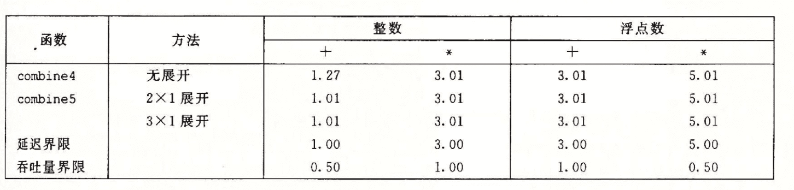
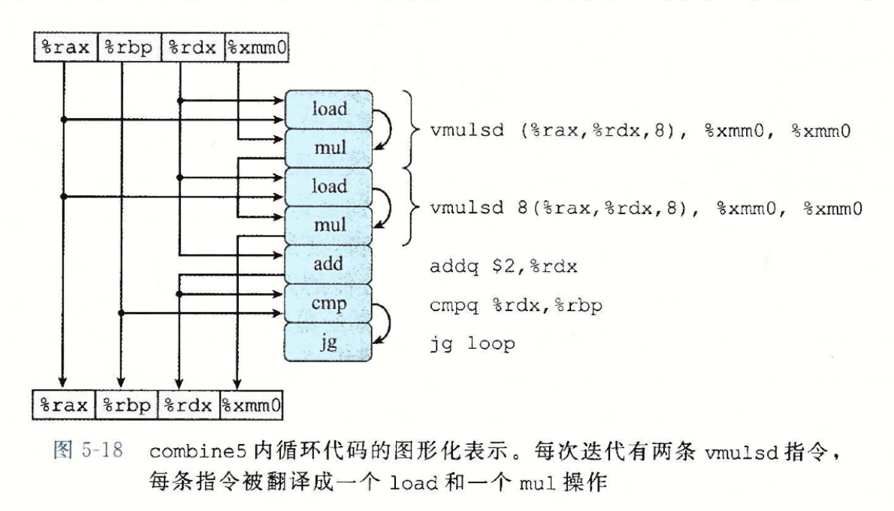
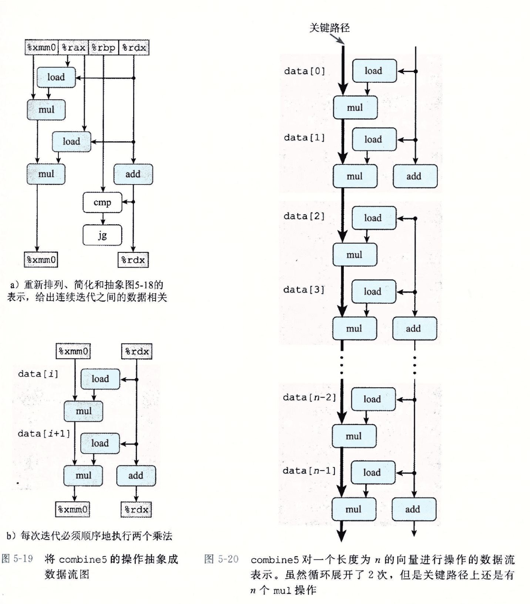
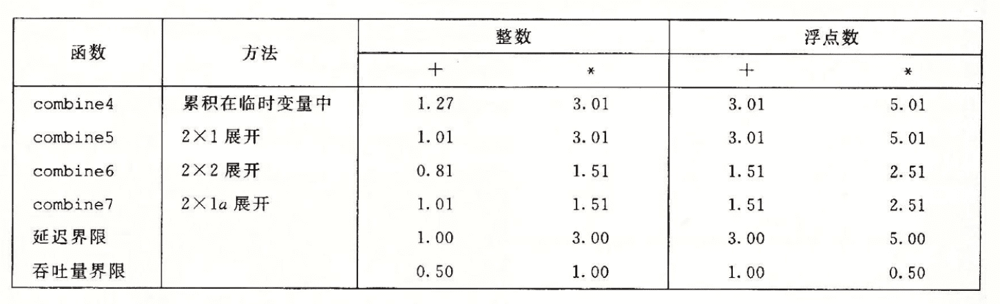
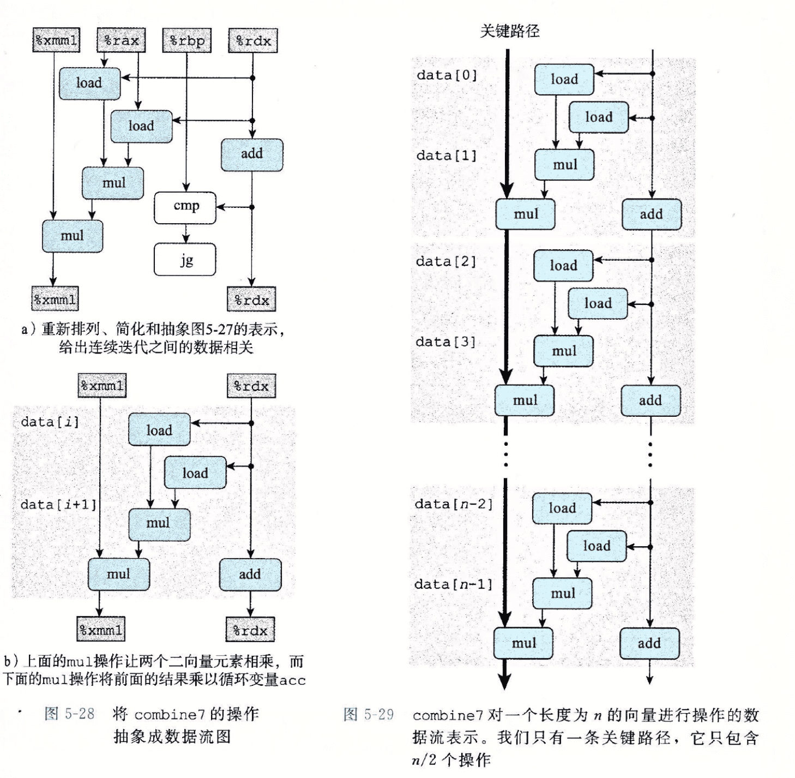

## 优化程序性能

### 内存别名使用

对于下面两个函数来说，执行相同的功能，但是在 twiddle2 效率更高一点（twiddle2 只执行 3 次内存引用，而 twiddle1 需要 6 次），在编译器优化的时候，可能不会把 twiddle1 优化为 twiddle 2

```c
void twiddle1(long *xp, long *yp) {
  *xp += *yp;
  *xp += *yp;
}

void twiddle2(long *xp, long *yp) {
  *xp += 2* *yp;
}
```

那是因为有可能 xp == yp, 这样 twiddle1 会将 xp 的值增加 4 倍，而 twiddle2 会将 xp 的值增加 3 倍，这种情况叫做内存别名使用，因此编译器在进行安全的优化的时候必须假设指针有可能相同。

而对于那些具有副作用的函数（例如修改全局变量），GCC 总是假设函数会有副作用，保持所有的函数调用不变。

### 程序性能的表示

CPE （ 每元素的周期数）可以表明一个程序的性能，对于一个数组循环来说，不同形式的循环通过最小二乘拟合得到的线性公式的系数（斜率）会有所差别，我们把这个斜率就叫做<strong>每元素的周期数</strong>。

例如

```c
void psum1(float a[], float p[], long n) {
  long i;
  p[0] = a[0];
  for(i = 1; i < n; ++i)
    p[i] = p[i - 1] + a[i];
}

void psum2(float a[], float p[], long n) {
  long i;
  p[0] = a[0];
  for (i = 1; i < n - 1; i += 2) {
    float mid_val = p[i - 1] + a[i];
    p[i] = mid_val;
    p[i + 1] = mid_val + a[i + 1];
  }
  
 	if (i < n) 
    p[i] = p[i - 1] + a[i];
}
```

统计两个函数的在不同 n 的情况下的执行周期可以得到 psum1 的运行时间近似为 368 + 9.0n， psum2 的运行时间近似为 368 + 6.0n，因此 psum2 的 CPE 为 6.0，psum1 的 CPE 为 9.0

### 对循环代码进行优化

初始代码

```c
void combine1(vec_ptr v, data_t *dest) {
  long i;
  *dest = IDENT;
  
  for(int i = 0; i < vec_length(v); ++i) {
    data_t val;
    get_vec_element(v, i, &val);
    *dest = *dest OP val;
  }
}

int get_vec_element(vec_ptr v, long index, data_t *index) {
  if (index < 0 || index >= v->len)
    return 0;
  *dest = v->data[index];
  return 1;
}
```

#### 代码移动

代码移动用于消除循环的低效率。识别出在循环里或者会多次执行但是计算结果不会发生改变的计算，将计算移动到代码前面不会被多次求值的部分。

例如在循环条件判断的时候重复求得数组或者字符串的长度，就可以将计算长度的代码移动到循环之前，存储到变量中。

```c
void combine2(vec_ptr v, data_t *dest) {
  long i;
  long length = vec_length(v);
  
  *dest = IDENT;
  
  for(int i = 0; i < length; ++i) {
    data_t val;
    get_vec_element(v, i, &val);
    *dest = *dest OP val;
  }
}
```

#### 减少过程调用

过程调用会带来开销，在循环中每次都调用 get_vec_element 来获取下一个向量元素。对于每一个元素，都要把向量索引 i 与循环边界进行比较，会造成低效率。作为替代，可以在循环之前获得数组的起始位置。由于知道循环不会超出数组的边界，因此直接读取数组元素值即可。

```c
void combine3(vec_ptr v, data_t *dest) {
  long i;
  long length = vec_length(v);
  data_t* data= get_vec_start(v);
  
  *dest = IDENT;
  
  for(int i = 0; i < length; ++i) {
    *dest = *dest OP data[i];
  }
}
```

但是经过统计程序性能并没有提升，因此内循环的其他地方形成了瓶颈。

为什么性能并没有提升，是因为在调用 get_vec_element 的时候，处理器总是预测索引不会超出边界的分支，因此不会导致预测错误处罚。

#### 消除不必要的内存引用

combine3 函数将结果累积在 *dest 内存位置，每次循环调用都会先从内存中读出数据，然后计算后再写入。为了消除不必要的内存读写，我们可以用临时变量存储计算值，然后再一次写入内存

```c
void combine4(vec_ptr v, data_t *dest) {
  long i;
  long length = vec_length(v);
  data_t* data = get_vec_start(v);
  long acc = IDENT;
  
  for(int i = 0; i < length; ++i) {
    acc = acc OP data[i];
  }
  *dest = acc;
}
```

相比 combine 3，combine 4 的效率提高了 2～7 倍，整数加法情况下 CPE下降到了 1.27 个时钟周期。

#### 利用处理器结构

<strong>延迟界限</strong>代表一个运算单元严格完整执行一个操作的完整时间。例如处理器中的乘法单元有三级流水，那么它的延迟就是 3， 代表没有流水化条件下的执行延迟。

<strong>吞吐界限</strong>代表完全流水化之后的最大执行指令数目，例如处理器有两个浮点乘法单元，它们的发射时间都为 1，则在完全流水化条件下，整个处理器的吞吐量为 1 / 2 = 0.5，即每个操作占用 0.5 个时钟周期，突破 1 的界限，这种结构称之为超标量设计。吞吐量界限给出了 CPE 的最小界限。

#### 循环展开

循环展开通过增加每次迭代时计算元素的数量，减少循环的迭代次数。

当将循环次数按照 k X m 展开时，表示将循环次数减少 k 倍，每次计算 m 个元素。例如按照 2 X 1 循环展开

```c
void combine5(vec_ptr v, data_t *dest) {
  long i;
  long length = vec_length(v);
  long limit = length - 1;
  data_t *data = get_vec_start(v);
  data_t acc = IDENT;
  
  for(i = 0; i < limit; i += 2) {
    acc = (acc OP data[i]) OP data[i + 1];
  }
  
  for(; i < length; i++) {
    acc = acc OP data[i];
  }
  *data = acc;
}
```

按照 2 X 1 展开，对于整数加法，得到的 CPE 会比 combine4 小，已经达到延迟界限，这样做得益于减少了循环开销。而其他情况并没有显著减小 CPE，已经达到了延迟界限。



对 combine 5 2 X 1 展开生成的汇编代码进行分析数据流程图，如下：

```assembly
.L35:
vmulsd (%rax, %rdx, 8), %xmm0, %xmm0
vmulsd 8(%rax, %rdx, 8), %xmm0, %xmm0
addq $2, %rdx
cmpq %rdx, %rbp
jg .L35
```





可以看到每次计算都要走两次乘法，总共还是 n 个乘法操作，所以并不会低于延迟界限。

由于 acc 被放在 %xmm0 寄存器里，因此每一次乘法都要等待上次计算完成之后才会执行。所以为了提高并行性，利用多个乘法单元，我们可以使用多个累积变量进行操作。

```c
void combine6(vec_ptr v, data_t *dest) {
  long i;
  long length = vec_length(v);
  long limit = length - 1;
  data_t *data = get_vec_start(v);
  data_t acc0 = IDENT;
  data_t acc1 = IDENT;
  
  for(i = 0; i < limit; i += 2) {
    acc0 = acc0 OP data[i];
    acc1 = acc1 OP data[i+1];
  }
  
  for(; i < length; i++) {
    acc0 = acc0 OP data[i];
  }
  *data = acc0 OP acc1;
}
```

这样的两次循环展开和两路合并，称之为 2X2 循环展开。最终性能测试 CPE 打破了延迟界限的限制，每个关键路径只包含 n / 2 个操作。如果执行 k X k 此循环展开，那么当 k 值足够大的时候，CPE 就会逼近吞吐极限。

因此只要保证该操作所有功能单元的流水线都是满的，程序才能达到这个操作的吞吐量界限。对延迟为 L、容量为 C 的操作而言，要求循环展开因子 k >= C * L。

#### 重新结合变换

对于 combine5 而言，如果我们利用结合定律将 ( data[i] OP data[i+1] ) 先计算，称为 combine7，CPE 性能会缩小 2 倍



分析关键路径可知只有一个 mul 操作会循环使用寄存器



但是对于这种重新结合变换，要注意在浮点数加法和乘法的时候，有可能会发生舍入或者溢出，因此不一定能够使用重新结合变换的方式
