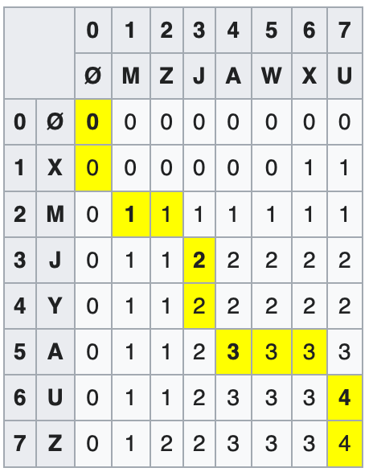

## Rust 资源的所有权

Rust 中每个变量都有生命周期和所有权，在创建引用的时候，相当于所有权借用（borrow），编译器会要求程序正确处理资源的所有权。

所有权借用图示流程可以参考[这篇文章](https://www.notion.so/Rust-94aebbb2df77462bbc20b5536c611106#878feb4fbe6b4764874c06760874bf9f)。这里贴一张里面的图片，比较清楚的展示所有权的借用过程


总结下来就是

1. 引用的生命周期不能超过原资源的生命周期，且引用不能被移动
2. 可变引用和不可变引用不能共存，可以同时创建多个不可变引用，但是可变引用只能创建一个，并可以降级为不可变引用。
3. 不可变引用的时候，原资源能拷贝，但不能移动
4. 可变引用的时候，原资源不能拷贝，也不能移动

当使用值或者引用的形式作为参数传给函数时，对应的使用权也会转移到函数内部。即如果传递值，则相对应的资源所有权就传递到函数内，除非函数再将所有权返回，否则在函数调用者一侧就无法再次使用该资源。

### 代码示例

```rust
fn main() {
    let s1 = String::from("hello");
    let mut v = Vec::new();
    v.push(s1);
    // 此处不能编译，因为此处发生了copy，但是 String 并没有实现
		// Copy trait，建议使用引用借用使用权
	  let s2: String = v[0];
    println!("{}", s2);
}
```

```rust
fn main() {
    let mut s = String::from("hello");
    let ref1 = &s;
    let ref2 = &ref1;
    let ref3 = &ref2;
  	// 此处资源发生移动，无法编译
    s = String::from("goodbye");
    println!("{}", ref3.to_uppercase());
}
```

```rust
fn drip_drop() -> &String {
    let s = String::from("hello world!");
    return &s;
    // 离开函数作用域之后，s就会被释放，引用无效
}
```

## Rust 的错误处理

Rust 提供多种错误处理方式，如果一个错误是不可恢复的，则可以使用 panic! 直接抛出错误并终止程序执行；如果一个错误是可恢复的，那么可以返回 Result<T, E>，如果是正常情况，返回 Ok(T)，错误情况，返回 Err(E)。

```rust
fn poke_toddler() -> Result<&'static str, &'static str> {
    if get_random_num() > 10 {
        Ok("Hahahaha!")
    } else {
        Err("Waaaaahhh!")
    }
}
```

Rust 还提供了方便处理 Result 返回值的语法糖，可以使用 unwrap 和 expect 获得 Ok 对应的返回值，如果发生错误，unwrap 会直接 panic，而 expect 允许传入一个发生错误时输出的字符串。

而 ？符号在返回 Ok 的时候获得返回值，如果发生错误，会继续向上原封不动抛出错误。

如果我们已经知道如果代码正确不管什么外部输入都不会导致发生错误，就可以大胆使用 unwrap，类似于 C 语言中的 assert。

## rdiff

week 2 的 rdiff 利用 LCS（Long Common Substring）比较两个文件之间的差异。在实现 LCS 的时候利用自定义实现的 Grid 结构体。

### 文件读取

摘自 Rust cookbook ➡️ [指路](https://rust-lang-nursery.github.io/rust-cookbook/file/read-write.html#read-lines-of-strings-from-a-file)

```rust
use std::fs::File;
use std::io::{Write, BufReader, BufRead, Error};

fn main() -> Result<(), io::Error> {
  let path = "lines.txt";
  let input = File::open(path);
  let buffered = BufReader::new(input);
  
  for line in buffered.lines() {
    println!("{}", line?);
  }
  
  Ok(())
}
```

### 范围

Rust 在 match 的时候可以使用范围匹配，但是范围不能使用 runtime value，只能使用编译时确定好的范围值。

```rust
fn main() {
  let val = get_random_value();
  match val {
    // Rust 推荐使用[1, 3]全包含的形式
    1..=3 => {
      // Do something
    }
  }
  // 使用 contains 判断是否在范围内
  if (1..=3).contains(&val) {
    // val 在范围内
  }
}
```

### LCS

Longest Common Sequence，找到两个字符串最长的公共子序列（不连续），使用动态规划
$$
D[x, y] =
\begin{cases}
D[x - 1, y - 1] & \text{if } str1[x] = str2[y] \\
max\{D[x-1, y], D[x, y-1]\} & \text{if } str1[x] \ne str2[y]
\end{cases}
$$
如果想要得到具体的公共子序列，可以按照计算的顺序倒序找到子序列



图中黄色的就是获得 LCS 的路径。如果用到 diff 当中，如果从$D[x, y] => D[x-1, y]$，则表明 Y[y] 是多余的字符，同理如果向上👆，则表明 X[x] 时多余的字符。

#### 优化方法

由于动态规划只需要数组的当前行和上一行，因此我们可以使用两个滚动数组存储计算的中间值，而不是用一整个方阵。

对于代码这种整行的字符串比较，我们可以使用字符串的 hash 值进行比较，减少所需要比较的字符串长度和数量，虽然 hash 算法会存在碰撞的风险，我们可以选择使用密码学的 hash 算法进行计算。

可以使用递归来让打印路径，如果不想使用递归，也可以在动态规划的时候记录当前位置的上一个的位置，最后再进行遍历。

#### Hunt-Szymanski 算法

时间复杂度 O(nlogn)，最坏复杂度O(n^2logn)

// TODO

https://codeforces.com/blog/entry/91581

## 小感想

在做这些小项目的时候，都是有明确的步骤，有搭好的框架进行填充，还有简单的测试快速得到反馈。在实现自己的项目的时候，也可以按照这样，先明确好需求和所拥有的接口，然后编写简单的测试，有点类似 TDD 的思路，能够及时得到正反馈。
