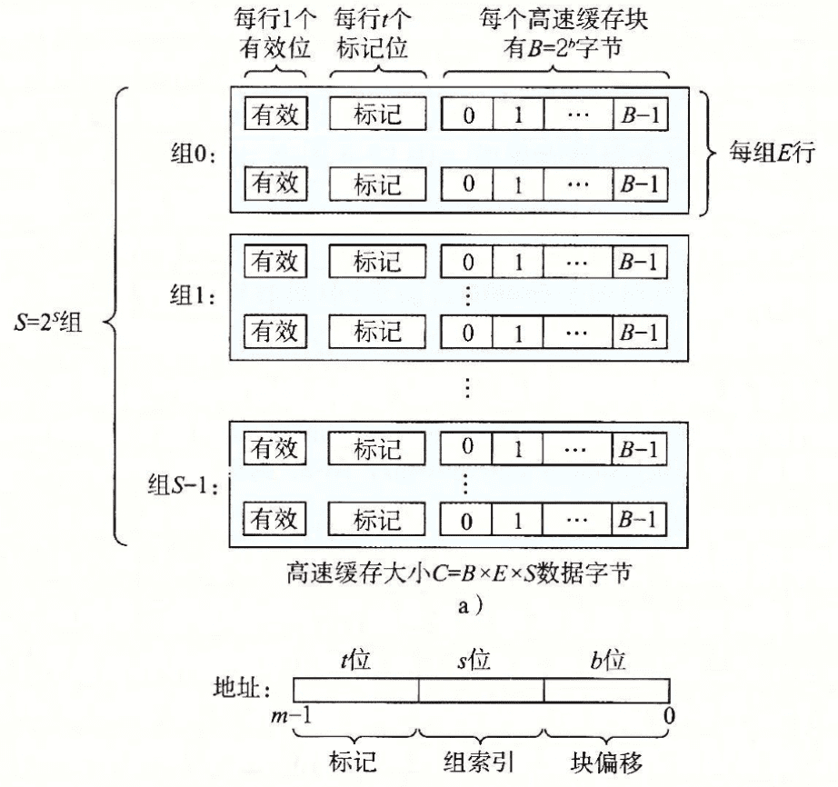
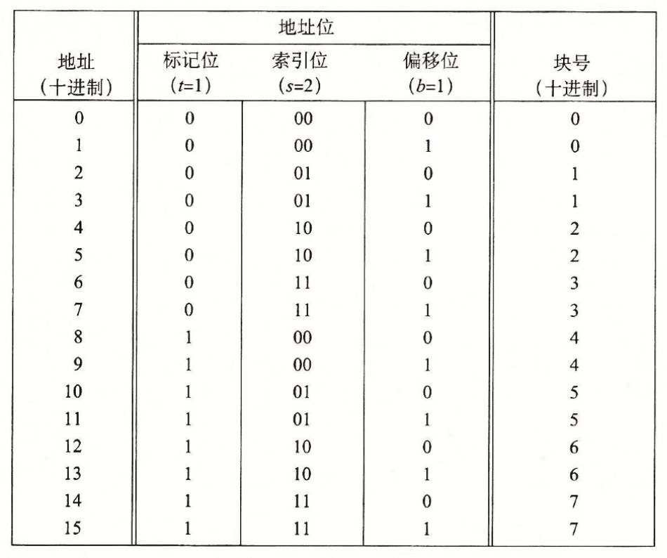
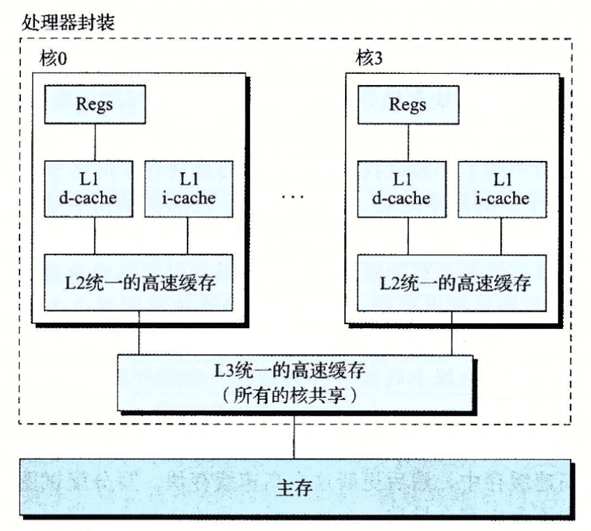

## 计算机的存储结构

在 CPU 的简单模型中，存储器系统是一个线性的字节数组，CPU 能够在常数时间内访问它，而实际上存储器系统是一个具有多种容量、成本、访问时间的存储设备的层次结构。

计算机程序具有“局部性”的特点，即程序倾向于一次又一次访问相同的数据项集合，或者倾向于访问邻近的数据项集合，因此我们可以使用具有较小访问时间的存储设备缓存这些频繁访问的数据，从而能够提高程序的运行时间。

### 局部性

局部性分为“时间局部性”和“空间局部性”，时间局部性指被引用过一次的内存位置很可能在不远的将在被再次引用，空间局部性指如果一个内存位置被引用了一次，那么程序可能在不远的将来引用附近的一个内存位置。

程序应该合理使用这两个局部性，因为不管是计算机系统还是操作系统，都尽可能利用程序的局部性设计缓存结构提高数据的访问速度。

程序对内存使用的局部性体现为对每个变量的引用模式

```c
int sumvec(int v[N]) {
  int i, sum = 0;
  for (i = 0; i < N; ++i) {
    sum += v[i];
  }
  return sum;
}
```

sumvec 函数对 sum 变量的访问符合时间局部性，对向量 v 的元素是按照在内存中存储的顺序读取的，因此，对于变量 v，函数有很好的空间局部性。

对于像这种顺序访问一个向量的元素的函数，具有`步长为 1 的引用模式`，也称之为`顺序引用模式`，如果步长为 k，即每隔 k 个元素进行访问，就称之为`步长为 k 的引用模式`，随着步长的提高，空间局部性也就下降。

而对于取指令的局部性，循环体具有较好的时间局部性和空间局部性。通常循环体越小，局部性越好。

### 缓存

在存储器层次中，高一级的存储设备通常是低一级存储设备的缓存，每级存储设备之间以“块”为单位转移数据。当程序需要第 k + 1 级的数据时，首先会在第 k 级的一个块中寻找数据，找到的结果分为若干情况：

1. 缓存命中

   如果数据刚好在第 k 级缓存，我们称之为“缓存命中”

2. 缓存不命中

   如果在第 k 层没有缓存数据对象 d，那么发生缓存不命中，需要从第 k + 1 层中取出包含数据的块，并覆盖第 k 层现有的一个块，称之为“替换”或者“驱逐”，决定替换哪个块是由缓存的替换策略决定的，例如随机替换或者 LRU 替换。

   缓存不命中分为若干种类型：

   1. 冷缓存：缓存初始为空，必不命中
   2. 冲突不命中：为了加快访问速度，一般会以某种策略规定第 k + 1 的某些块固定放在第 k 级的某些块中。这样限制性的访问策略会导致程序在频繁访问某些固定放在一起的数据时，会出现一直不命中的现象。
   3. 容量不命中：程序在每个阶段访问缓存块的某个相对稳定不变的集合称为工作集，如果工作集的大小超过了缓存的大小时，缓存就会经历容量不命中。

### 高速缓存存储器

早期的存储器结构只有三层：CPU 寄存器、DRAM 主存储器和磁盘存储器，随着 CPU 与 DRAM 的速度差距越来越大，CPU 内部逐渐加上了 L1、L2、L3 级高速缓存

高速缓存的通用组织结构如下图所示：



每个高速缓存可以用（S、E、B、m）四元组表示，高速缓存的大小 $C = S \times E \times B$，E 为每组包含的高速缓存行（cache line）的行数。

根据四元组不同的值，高速缓存也可以被分为不同的类型

> 为什么要用中间的位作为组索引，而不是用高位来做索引？是因为如果用高位做索引，一些连续的内存块就会映射到相同的高速缓存块中。如果一个程序有良好的局部性，那么就会导致高速缓存块的使用率会很低。

#### 直接相连高速缓存

E = 1，每组只有一行 cache line。当 CPU 执行读内存地址 w 时，会在缓存内将地址划分成标记、组索引和块偏移三部分，并确认是否缓存命中🎯

1. 组选择，通过组索引确定相应的组
2. 行匹配，由于每个组只有一行，我们只需要判断行有效位是否有效，且标记是否与地址内的标记相同，如果相同，就代表命中，如果行无效或者标记不匹配，则请求不命中
3. 字选择，使用块偏移找到对应位置的字节

如果发生命中，就直接从缓存中取出数据。如果不命中，则需要从低一级的存储设备中取出副本，替换缓存中的某个块。

我们将标记位和索引位连起来称之为一个块，因此对于 (S, E, B, m) = (4, 1, 2, 4) 的直接映射缓存来说，地址划分如下所示：



可以看到有8个块号，但是映射到了四个缓存组，所以多个块会映射到同一个高速缓存组中，很容易出现缓存抖动的现象，即每发生一次不命中，如果两个地址都映射到了同一个缓存组里面，都要把组中所有字节都替换掉。

为什么要用中间位来作为高速缓存组的索引，而不是头部几位，是为了将内存连续的几块分布到不同的缓存组中，从而避免发生频繁的替换。

#### 组相连高速缓存

组相连高速缓存的特征是 1 < E < C/B，称为 E 路组相连高速缓存，即每组高速缓存内部有 E 行

它和直接映射的区别在于在行匹配的时候需要查找组里的所有行，找到一个有效且标记位与地址中的标记位相同的高速缓存行。

如果发生不命中，就需要替换组内的某一行，如果组中没有空行，就需要使用一定的算法替换掉某一行。根据局部性原理，我们可以使用 LFU 去替换在过去某个时间窗口内引用次数最少的那一行，LRU 替换最后一次访问时间最久的那一行。

#### 全相联高速缓存

全相联高速缓存 E = C / B，即只有一个组，因此地址中没有组索引位。其索引的方式和组相连高速缓存类似，区别只是规模大小的问题。因为高速缓存并行地搜索许多相匹配的标记，因此全相联高速缓存只适用于做小的高速缓存，例如 TLB 等。

### 写缓存

高速缓存对于写的处理要更复杂一点，假设我们已经写了一个缓存了的字节（写命中），在高速缓存内部更新之后，怎么更新低一级的副本呢？

- 直写（write-through），每次立即将缓存更新到低一层中，虽然简单，但是每一次都会发起总线请求
- 写回（write-back），推迟更新，只有当替换算法要驱逐这个更新过的块后，才会把这个块写入的低一层中，这种减少了总线请求，但是要求高速缓存必须为每个 cache line 维护一个额外的修改位，表明是否被修改过

如果发生了写不命中怎么办，即写入的地址不在缓存当中？

- 写分配（write-allocate），加载相应的低一级的块到高速缓存中，然后更新高速缓存。这种方法试图利用写的局部性，但是每次不命中都会导致一个块从低一级到高一级传送。
- 非写分配（non-write-allocate），避开高速缓存，直接将数据写入到低一级的设备中。

通常直写是使用非写分配，而写回是使用写分配。

### 高速缓存不同参数对性能影响

- 高速缓存的大小：较大的高速缓存可能会提升命中率，但是也会增加命中时间（需要寻找对应的 ca che line），将大缓存提高运行速度总是要难一些。
- 块大小：在整体容量一定的情况下，大的块能够利用程序的空间局部性，但是块越大表明行数越小，更容易影响时间局部性的命中率，且不命中处罚时间也比较大。
- 相连度：相连度越高会造成较高的成本，需要更多的标记位和额外的处理逻辑。较高的相连度会增加命中时间和不命中处罚，传统上层次较高的缓存会选择低相连度来提高时钟频率。
- 写策略的影响：直写缓存比较容易实现，能够使用独立于高速缓存的写缓存区，将写内容更新到内存中，但是会占用一部分内存带宽。而写回缓存会减少传送，允许更多的内存带宽执行 DMA 操作，常用于较低层次的缓存中。

### 真实高速缓存的层次结构

在真实 CPU 中，每个 CPU 都会有独立的指令缓存 i-cache 和数据缓存 d-cache，也有既存储数据，又存储指令的 unifed cache。两个独立的高速缓存能够保证指令和数据之间不会发生冲突不命中。

在 Intel 的芯片中，通常有 L1、L2、L3 三级缓存



## 优化程序合理利用缓存

- 大部分计算和内存访问都在内循环里，因此集中优化内循环
- 按照数据对象存储在内存中的顺序，以步长为 1 来读数据，从而使空间局部性最大
- 一旦从存储器中读入了一个数据对象，就尽可能地多使用，从而使程序中的时间局部性最大

## cachelab

### 实现缓存模拟器 csim

>读取 valgrind 生成的缓存 trace 文件，模拟不同参数下的缓存的读写情况，并最终打印出命中率/非命中率

Valgrind 的 trace 文件格式如下

```
I 0400d7d4,8
	M 0421c7f0,4
	L 04f6b868,8
	S 7ff0005c8,8
```

表示 operation、address、size，M 表示数据更改，L 表示读取数据，S 表示写入数据，I 表示指令读取。

csim 需要支持上述三种缓存架构存储器，支持指定 set_index, block_index 和 associativity （每个集合中有几个缓存行），注意 associativity 指定的 line 只是可以用来创建动态数组，在缓存地址中不存在 line 这个部分，只包含 set_index、block_index 和 tag

#### 定义结构体

为了模拟缓存，我们需要定义 cache 各级的结构，在此处定义 cache_t、set_t、line_t ，每个 line_t 代表一个 block，表示一个 cache line。

```c
struct line {
    bool valid;
    struct line *prev, *next;
    ull tag;
    uint8_t* block;
};

typedef struct line line_t;

/**
 * @brief one set in a cache
 */
typedef struct {
    line_t* lines; 
    line_t head, tail;
} set_t;

/**
 * @brief a cache
 */
typedef struct {
    set_t* sets;
} cache_t;
```

为了支持不同结构的 cache，cache_t 相关数据结构都使用动态分配，并注意在释放内存的需要检查是否分配，如果没分配就跳过释放。

由于在每个 cache 满的时候需要选择一个缓存线进行替换，因此每个 line_t 还需要包含两个指针形成双向链表，便于实现 LRU 算法

#### 仿真过程

由于 valgrind 产生的 trace 只包括 L、M、S 三种操作，整个仿真过程也就是围绕着这三个操作来分别处理。

首先是判断 hit 的过程，在解析出地址对应的 set 编号、tag 后，就可以找到对应的 set_t，然后遍历这个 set 的所有 cache line，如果找到 tag 一致的，就表明 hit 了，注意 M 操作符下应该 hit 两次（等效于 load 和后面跟的 store 操作同一个地址）。如果没找到 tag 一致的，表明发生 miss，需要根据操作符进行讨论。

1. L 操作符。Load 操作在 miss 情况下需要从低一级的 cache 中读取数据，并找到一个空的 cache line 放置数据，实际代码编写的时候只需要将该 cache line 的标志位设置为有效即可。如果没有空的 cache line，就需要使用 LRU 将最近最少使用的 cacheline 踢出去（eviction），将新的数据放在这个 cache line。
2. S 操作符。和 Load 操作一样，根据文档中的描述和 csim-ref 的输出，写入操作使用的是写回，因此在 miss 的时候会使用写分配，即和 Load 操作一样从低一级的 cache 读取数据并写入 cache
3. M 操作符。由于 Modify 操作等效于对同一个地址先进行 Load 操作，再进行 Store 操作，因此我们首先执行 Load 的 miss 操作，然后之后的 Store 操作一定会命中。
