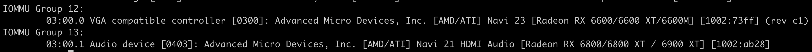
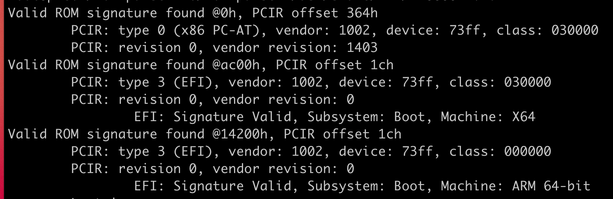

PVE 做显卡直通经常出现错误代码 43 的情况，不出意外我也碰上了，下面是我的所有配置和操作步骤，也是折腾了半天，扒了很多论坛。虽然不知道哪个地方解决了问题，但是现在是能够正常工作，所以发出来供参考。

## 主机配置

主板：ASUS B460M Pro

CPU：Intel i7-10700

显卡：AMD RX6600XT

PVE版本：6.4

## 配置步骤

首先需要更新主板的 BIOS 到最新版本，然后开启主办的虚拟化功能，包括 VT-d、IOMMU、CPU 虚拟化，关闭 CSM，然后最好将主板的首选显卡改为 PEG。

然后按照 PVE 官方的[教程](https://pve.proxmox.com/wiki/Pci_passthrough)配置到 `Verify IOMMU Isolation` 这一步，在 PVE 中使用下面脚本检查是否显卡在一个单独的 IOMMU 组里

```bash
shopt -s nullglob
for g in `find /sys/kernel/iommu_groups/* -maxdepth 0 -type d | sort -V`; do
    echo "IOMMU Group ${g##*/}:"
    for d in $g/devices/*; do
        echo -e "\t$(lspci -nns ${d##*/})"
    done;
done;
```

如果有类似下面的输出，就代表显卡在一个单独的 IOMMU 组里面。



很遗憾，我的这个主板的 IOMMU 分组就是个💩，所以需要开启 ACS 补丁，这个补丁需要 CPU 支持，具体参考 PVE 官方教程里面的介绍，一般比较新的 CPU 都支持。PVE 自带 ACS 补丁，只需要在 /etc/default/grub 里的 GRUB_CMDLINE_LINUX_DEFAULT 项里面添加 "pcie_acs_override=downstream,multifunction"，然后重启即可看到 IOMMU 中每个 PCIE 设备都在单独一个分组里面。

### 打 vendor-reset 补丁

这个是官方教程里面说 RX6XXX (XT) 系列会存在复位不正确的 bug，需要打这个 [vendor-reset](https://github.com/gnif/vendor-reset) 补丁，写在这里仅供参考，参考里面的说明进行安装即可。

### 创建 WIN10 虚拟机

参照 PVE 官方的 [win10 best practice](https://pve.proxmox.com/wiki/Windows_10_guest_best_practices) ，并且在选择 BIOS 的时候要选 OVMF，即使用 UEFI 启动，然后继续按照上面官方直通教程的 GPU Passthrough 一节中的指导，使用 GPU OVMF PCI Passthrough 的方式。

### 提取显卡 ROM

```bash
cd /sys/bus/pci/devices/0000:01:00.0/
echo 1 > rom
cat rom > /tmp/image.rom
echo 0 > rom
```

注意上面的 0000:01:00.0 要换成自己的显卡的 pci 地址，然后可以使用 [rom-parser](https://github.com/awilliam/rom-parser) 校验一下显卡固件是否支持 UEFI 启动，即输出的解析内容里面有 type 3 即可。



然后将提取出来的rom（在上面代码里面是 image.rom）放到 /usr/share/kvm 路径下，然后在 win10 虚拟机的配置文件中加入 rom 文件，配置项完成如下

```
hostpci0: 0000:03:00,pcie=1,romfile=RX6600XT.rom,x-vga=1
```

### 设置 cpu 选项

在虚拟机配置文件中添加 CPU 选项

```
cpu: host,hidden=1,flags=+pcid
```

### 设置虚拟机显示输出

将 WIN10 虚拟机的自带显示输出为 none，只通过显卡进行输出。

如果不出意外的话直通就应该能成功了！

然后在 WIN10 里面安装 AMD 的驱动即可，安装完成在设备管理器里就能看到不带黄色感叹号的显卡了！

## 所有相关配置文件

### 虚拟机配置文件

```
agent: 1
bios: ovmf
boot: order=scsi0;ide2;net0
cores: 8
cpu: host,hidden=1,flags=+pcid
efidisk0: disk-img:100/vm-100-disk-1.qcow2,size=128K
hostpci0: 0000:03:00,pcie=1,romfile=RX6600XT.rom,x-vga=1
ide0: local:iso/virtio-win-0.1.185.iso,media=cdrom,size=402812K
ide2: local:iso/SW_DVD9_Win_Pro_10_20H2_64BIT_ChnSimp_Pro_Ent_EDU_N_MLF_-2_X22-41514.ISO,media=cdrom
machine: pc-q35-5.2
memory: 16384
name: Win10
net0: virtio=02:F7:CD:B6:9A:56,bridge=vmbr1,firewall=1
numa: 0
onboot: 1
ostype: win10
scsi0: disk-img:100/vm-100-disk-0.qcow2,cache=writeback,discard=on,size=200G
scsihw: virtio-scsi-pci
smbios1: uuid=ced7dbb9-bc4f-473b-804e-f9720a6ce54b
sockets: 1
usb0: host=046d:c53f,usb3=1
usb1: host=0483:522a,usb3=1
usb2: host=2-5,usb3=1
vga: none
vmgenid: d0749618-e1e9-4a4c-8b51-162eac4f26a4
```

### GRUB 配置文件

```bash
GRUB_DEFAULT=0
GRUB_TIMEOUT=5
GRUB_DISTRIBUTOR="Proxmox Virtual Environment"
GRUB_CMDLINE_LINUX_DEFAULT="quiet nomodeset intel_iommu=on iommu=pt video=efifb:off,vesafb:off pcie_acs_override=downstream,multifunction"
GRUB_CMDLINE_LINUX=""
```

### blacklist

```
blacklist radeon
blacklist nouveau
blacklist nvidia
```

### vfio.conf

```
options vfio-pci ids=1002:73ff,1002:ab28 disable_vga=1
```
