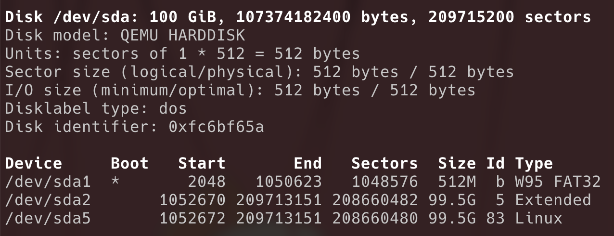
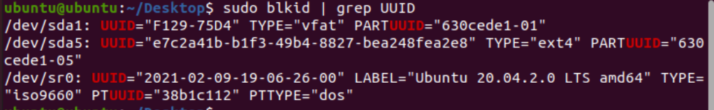
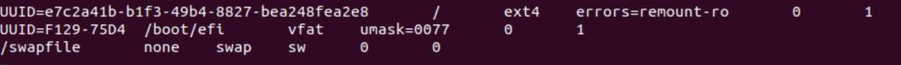

## 名词定义

CT：运行在 PVE 上要迁移的 ubuntu 源容器

VM：运行在 PVE 上的目标虚拟机

## 迁移步骤

在 PVE 中创建 VM，然后进入 desktop 镜像的 liveCD 模式，对 VM 上的硬盘（我的路径为 /dev/sda）进行分区和格式化。

默认分区为

- /dev/sda1 为 fat32 文件系统的主分区，可启动，存放 bootloader
- /dev/sda2 为逻辑分区
- /dev/sda5 为 ext4 文件系统格式的 Linux 分区



使用 fdisk 在 /dev/sda 上按照上述图片格式创建三个分区，并将 /dev/sda1 标记为 bootable （命令 a），然后使用命令格式化分区

```bash
mkfs.fat -F 32 /dev/sda1
mkfs.ext4 /dev/sda5
```

更新分区表并格式化之后，将 /dev/sda5 挂载（此处挂载到/mnt)，使用 rsync 将 CT 的内容拷贝到 /mnt/root，参考命令为

```bash
rsync -auHxv –numeric-ids –-exclude=/etc/network/* –-exclude=/proc/* –-exclude=/tmp/* –-exclude=/sys/* –-exclude=/dev/* –-exclude=/mnt/* –-exclude=/boot/* root@SRC-IP:/* /mnt/
```

拷贝完成后，由于原本的 CT 使用的是宿主机的内核，因此拷贝后需要重新下载并安装内核，从而能够被 bootloader 发现，并且需要更新 bootloader 和 fstab，能够正确启动并挂载硬盘。

要根据 CT 版本下载内核，我的是 ubuntu 21.04，下载了 5.11.0 的内核，可以下载编译好的 deb 包，包括 linux-headers，linux-images-unsigned 和 linux-modules。下载完之后安装 deb 包即可。

### 更新 fstab

fstab 文件用于声明启动时要挂载的硬盘分区。首先使用

```bash
blkid | grep UUID
```

 获取 /dev/sda 各个分区的 UUID



然后创建 /mnt/etc/fstab 文件，按照以下格式写入



前面两行的 UUID 对应 /dev/sda5 和启动分区 /dev/sda1

## 安装 grub

首先需要将 liveCD 上的 /dev、/sys、/run、/proc 重新挂载到 /mnt/ 下

```bash
sudo mount /dev /mnt/dev --rbind
sudo mount /sys /mnt/sys --rbind
sudo mount /run /mnt/run --rbind
sudo mount /proc /mnt/proc --rbind
```

在 /mnt/boot 处创建 efi 文件夹，然后将启动分区（此处是 /dev/sda1）挂载到 efi 位置。之后使用

```bash
chroot /mnt/
```

切换根目录。

```bash
sudo apt install initramfs-tools -y
sudo grub-install
update-initramfs -u -k ${KERNEL_VERSION}
sudo update-grub
sudo mkdir /proc
```

KERNEL_VERSION 指的是安装的内核版本，例如 5.11.0-051100-generic

grub-install 和 update-grub 命令用于更新 bootloader，之后可以停止 VM，更改 VM 的 boot order，将 scsi0 设为第一优先级。

最后重启即可从迁移的系统启动。
